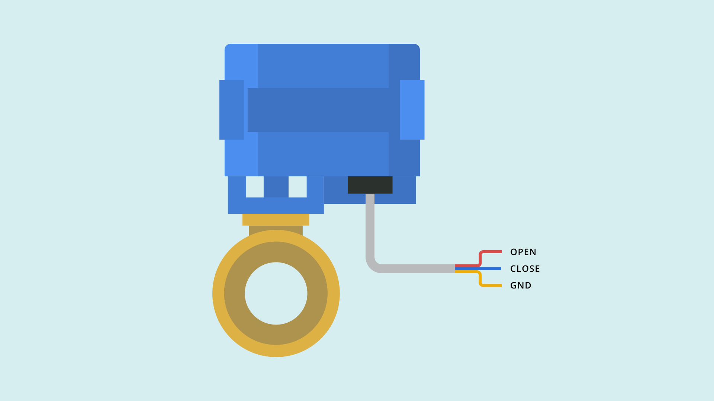

# Connecting and Controlling a Motorized Ball Valve 

## Overview

A ball valve is a form of quarter-turn [valve](https://en.wikipedia.org/wiki/Valve) which uses a hollow, perforated and pivoting ball to control flow of liquids and gasses through it. This tutorial will guide you to connect the board a 3 Wire-Valve and write a sketch that controls basic operation such as the opening and closing of the valves. 

***Tip : If this is for your first Edge Control project,  we recommend you to take a look at the [Getting Started Tutorial](https://www.arduino.cc/pro/tutorials/portenta-h7/ec-ard-gs) to setup the development environment before you proceed.*** 

### You Will Learn

-   How to connect a motorized valve to the edge control board
-   About the controlling the valve through basic commands provided by the `Arduino_EdgeControl.h` library
-   How to power the board with an external power supply 

### Required Hardware and Software

-   1 x [Arduino Edge control board](https://store.arduino.cc/edge-control)
-   1 x [US Solid Motorised Ball Valve (9 - 24 V)](https://ussolid.com/u-s-solid-motorized-ball-valve-1-2-brass-electrical-ball-valve-with-full-port-9-24-v-ac-dc-3-wire-setup.html)
-   External power source: 12V battery (LiPo / SLA) or power supply 
-   1 x Micro USB cable
-   Arduino IDE 1.8.10+ or Arduino Pro IDE 0.0.4+
-   2 x Phoenix connectors 1844646
-   2 x Jumper cables  

## Instructions 

### 1. Connecting The Valves

The motorized valve comes with three wires primarily marked as blue, yellow and red. The red and blue cables are for the positive and negative signals and the yellow is for the ground. 

 

You need to ensure that the Phoenix connectors are in place before plugging in the wires to the respective pins. If you havent link  

Connect the red and the blue wire to any one of the 8 pairs of `LATCHING OUT` pins. In this example we will use `1N` and `1P` of your Edge Control board. Latches allow you to store the state of the pins based on the previous output. As the valve doesnt come with internal drivers to store the state of the motor, we will use the `Latching_out` pins (instead of `Latching_out_cmd`) that are the ones that include drivers on the edge control. 


Connect the yellow wire to the nearby `GND` pin. Ensure that the wires are fastened securely and tightly to the Phoenix connectors so that they make contact with the pins. 

### 2. Opening And Closing The Valves 

Open a new sketch file on the Arduino IDE and name it `ValveControl.ino`. Add the header file `Arduino_EdgeControl.h` to your sketch 

```cpp
#include <Arduino_EdgeControl.h>
```

inside the `void setup()` , after enabeling the serial communication, run the initialization routine `EdgeControl.begin()` . This routine is in charge of enabling the default power areas of the board. Then use `Latching.begin()` to configure the expander pins as outputs.

```cpp
void setup()
{
    Serial.begin(9600);
    while(!Serial);

    delay(1000);

    Serial.println("3-Wire Valve Demo");

    EdgeControl.begin();
    Latching.begin();

    Serial.println("Starting");
}

```

Inside the `loop()`you will add the instructions to open and close the Valve. `Latching.channelDirection()` is used to control the signal to a particular pin using the parameter `LATCHING_OUT_1` and its direction using the parameters, `POSITIVE` or `NEGATIVE`. Hence, if you want the valve to open you will use the instruction, 

```cpp
Latching.channelDirection(LATCHING_OUT_1, POSITIVE)
```

and  to close the valve, you need to send a signal in the opposite direction using the command, 

```cpp
Latching.channelDirection(LATCHING_OUT_1, NEGATIVE)
```

As it takes a few seconds for the valve to fully open or close, you need to maintain the signal for a set amount of time. Using the command,  `Latching.strobe(4500)` you can adjust the duration of signal passed through a particular pin. 

```cpp
void loop()
{
    Serial.println("Closing");
    Latching.channelDirection(LATCHING_OUT_1, POSITIVE);
    Latching.strobe(4500);
    delay(2500);

    Serial.println("Opening");
    Latching.channelDirection(LATCHING_OUT_1, NEGATIVE);
    Latching.strobe(4500);
    delay(2500);
}
```

### 3. Connecting To A Power Source 

The Valves require a power supply of 9 - 12 V and you can either use a power supply or a 3 cell lipo battery to provide the required voltage. Power sources can be connected to the onboard relay ports of the edge control board. Connect two jumper wires to the **GND** and **B** pins of the **Relay ports** 


Connect the jumper from the **B** pin to the positive terminal of the Battery and the jumper from the **GND** pin to the negative terminal of the battery 

### 4. Uploading The Sketch 

Connect the board to your computer, upload the `ValveControl.ino` sketch and open the **Serial Monitor**. If all the connections are done right, the valve opens and closes and you should be able to see the status as `Open` or `Close` on the serial monitor 

## Conclusion

This tutorial explains how a 3 wire valve works and the basic operations of how the Edge Control board used to control the valves. With this knowledge you can build simple irrigation systems that will periodically control the valves that can be later installed in your field. 

### Complete Sketch

```cpp
#include <Arduino_EdgeControl.h>

void setup()
{
    Serial.begin(9600);
    while(!Serial);

    delay(1000);

    Serial.println("3-Wire Valve Demo");

    EdgeControl.begin();
    Latching.begin();

    Serial.println("Starting");
}

void loop()
{
    Serial.println("Closing");
    Latching.channelDirection(LATCHING_OUT_1, POSITIVE);
    Latching.strobe(4500);
    delay(2500);

    Serial.println("Opening");
    Latching.channelDirection(LATCHING_OUT_1, NEGATIVE);
    Latching.strobe(4500);
    delay(2500);
}

```

**Authors:** Ernesto E. Lopez, Lenard George Swamy. 
**Reviewed by:** Ernesto E. Lopez [2021-03-18].
**Last revision:** Lenard George Swamy [2021-04-06]. 