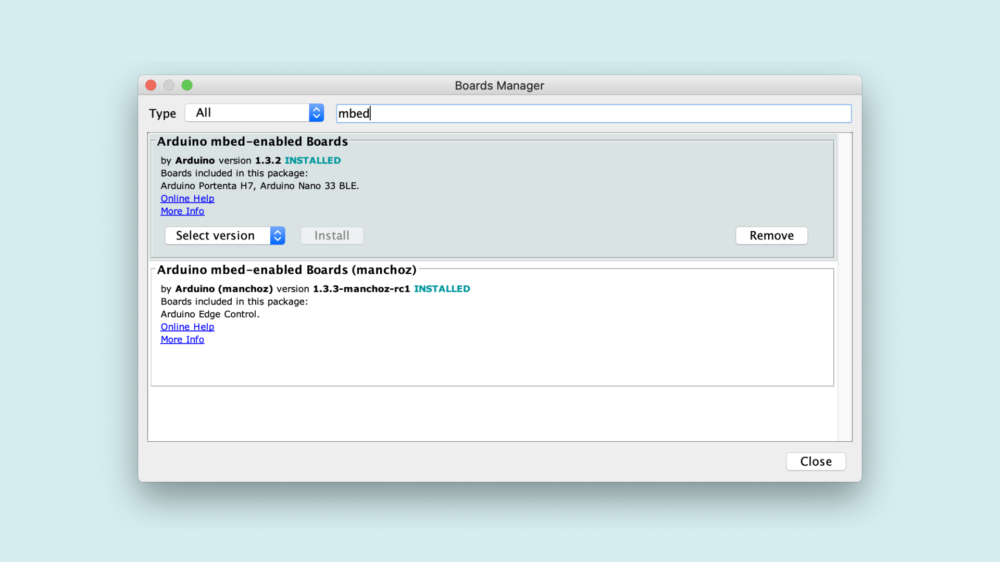
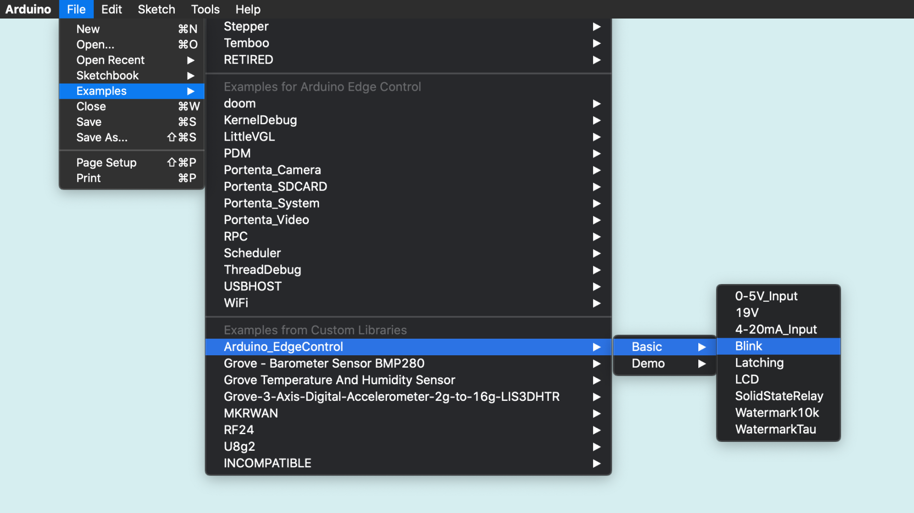
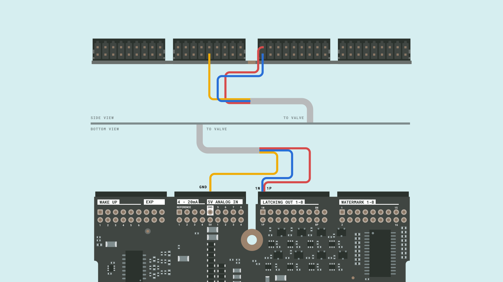
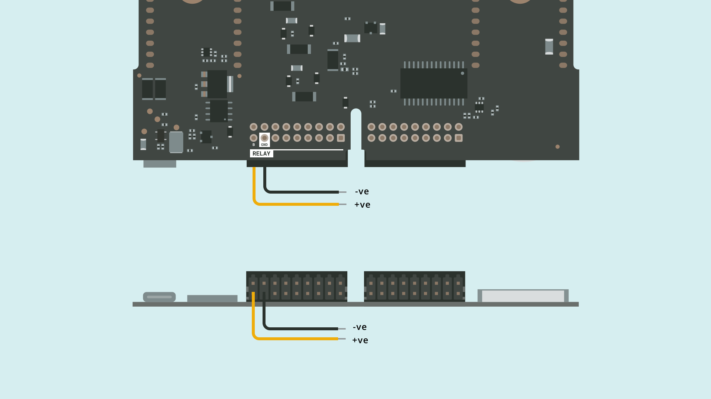

# Controlling a Motorized ball Valve 
## Overview

This tutorial gets you started with the Edge control board and goes over the basics of controlling a motorised ball valve to the board. 

### You Will Learn

-   How to connect a motorized valve to the edge control board,
-   About the controlling the valve through basic commands provided by the `Arduino_EdgeControl.h` library,
-   How to power the board with an external power supply, 

### Required Hardware and Software

-   Arduino Edge control board,
-   [1 x US Solid Motorised Ball Valve (9 - 24 V)](https://ussolid.com/u-s-solid-motorized-ball-valve-1-2-brass-electrical-ball-valve-with-full-port-9-24-v-ac-dc-3-wire-setup.html)
-   External power source (12V battery or power supply) - LiPo / SLA, 
-   Micro USB cable,
-   Arduino IDE 1.8.10+ or Arduino Pro IDE 0.0.4+
-   2 x Phoenix connectors 1844646
-   2 x Jumper cables.  

## Instructions 

A ball valve is a form of quarter-turn [valve](https://en.wikipedia.org/wiki/Valve) which uses a hollow, perforated and pivoting ball to control flow of liquids and gasses through it. With the Edge control control you can can control and automate the basic operation such as the opening and closing of the valves. You will first install the required core and the libraries required to use the Edge Control board and upload a blink sketch to check if everything is connected right. You will then connect the Valve and then write the sketch that opens and closes it at a certain interval. Finally, you will connect the board to an external power source and upload the sketch. 

[note]

**Note :** Ensure that the Phoenix connectors are in place before plugging in the wires to the respective pins 

[\note]

### 1. The Basic Setup

Before you start programming the Edge control board, you will have to download the [core]() from the board manager. Open the **Board manager** and look for the `Edge Control` core. This board comes with the **Nina B306** processor which is the same processor used in other Pro boards such as the **Portenta** and the **Nano 33 BLE**. 



Next you need to download the Example library that contains the Blink example. (identify how to install this library )

This blink sketch is to test if the board is recognised by the IDE and if you have installed the right core. In the classic Arduino IDE open the blink example by clicking the menu entry **File -> Examples -> Arduino_EdgeControl -> Basic -> Blink.**



Selected the right board and port under **Tools** and upload the blink example you find inside the example folder. Open the Serial monitor after uploading the sketch


If the Serial monitor dislpays `Blink` at an interval of ... seconds, you have  installed the right core and have successfully completed  the basic setup. Disconnect the board from your computer. 

### 2. Connecting the valve

The motorized valve comes with three wires primarily marked as blue, yellow and red. The red and blue cables are for the positive and negative signals and the yellow is for the ground. 

 

Connect the red and the bluw wire to any one of the 8 pairs of `LATCHING OUT` pins, `1N` and `1P` of your Edge Control board. Latches allow you to store the state of the pins based on the previous output. As the valve doesnt come with internal drivers to store the state of the motor, the with drivers on the `Latching_out`pins store the signal states without any power consumption.



Connect the yellow wire to the nearby `GND` pin. Ensure that the wires are fastened securely and tightly to the Phoenix connectors so that they make contact with the pins. 

### 3. Opening and Closing the valves 

Open a new sketch file on the Arduino IDE and name it `ValveControl.ino`. Add the header file `Arduino_EdgeControl.h` to your sketch 

```c++
#include <Arduino_EdgeControl.h>
```

inside the `void setup()` , start the serial communication and  EdgeControl.begin()->Starts power initialization of the board. Pin configuration. Disabling all power switches.
Latching.begin() -> configure expander pins as outputs.Inside . Begin ( Start the edge control board  , Power.begin )

```cpp
void setup()
{
    Serial.begin(9600);
    while(!Serial);

    delay(1000);

    Serial.println("3-Wire Valve Demo");

    EdgeControl.begin();
    Latching.begin();

    Serial.println("Starting");
}

```

Inside the `loop()`you will add the instructions to open and close the Valve. `Latching.channelDirection()` is used to control the signal to a particular pin using the parameter `LATCHING_OUT_1` and its direction using the parameters, `POSITIVE` or `NEGATIVE`. Hence, if you want the valve to open you will use the instruction, 

```c++
Latching.channelDirection(LATCHING_OUT_1, POSITIVE)
```

and  to close the valve, you need to send a signal in the opposite direction using the command, 

```c++
Latching.channelDirection(LATCHING_OUT_1, NEGATIVE)
```

As it takes a few seconds for the valve to fully open or close, you need to maintain the signal for a set amount of time. Using the command,  `Latching.strobe(4500)` you can adjust the duration of signal passed through a particular pin. 

```cpp
void loop()
{
    Serial.println("Closing");
    Latching.channelDirection(LATCHING_OUT_1, POSITIVE);
    Latching.strobe(4500);
    delay(2500);

    Serial.println("Opening");
    Latching.channelDirection(LATCHING_OUT_1, NEGATIVE);
    Latching.strobe(4500);
    delay(2500);
}
```

### 4. Connecting to a Power Source 

The Valves require a power supply of 9 - 12 V and you can either use a power supply or lipo batteries to provide the required voltage. Power sources can be connected to the onboard relay ports of the edge control board. Connect two jumper wires to the **GND** and **B** pins of the **Relay ports** 



Connect the jumper from the **B** pin to the positive terminal of the Battery and the jumper from the **GND** pin to the negative terminal of the battery 

[note]

we recommend using Lipo batteries. In this tutorial we have a Lipo more effiecitn, current discharge is higher and higher battery life. 

[/note]

### 5. Uploading the Sketch 

Connect the board to your computer, upload the `ValveControl.ino` sketch and open the **Serial Monitor**. If all the connections are done right, the valve opens and closes and you should be able to see th Open the serial monitor and it will display the status of the valves 


## Conclusion 

### Next Steps

-   Watermark / soil moisture sensor 
-   Remote activation 

### Complete Sketch

 

## Troubleshooting

### Sketch Upload Troubleshooting

Lorem ipsum dolor sit amet, consectetuer adipiscing elit. Aenean commodo ligula eget dolor. Aenean massa. Lorem ipsum dolor sit amet, consectetuer adipiscing elit. Aenean commodo ligula eget dolor. Aenean massa. Lorem ipsum dolor sit amet, consectetuer adipiscing elit. Aenean commodo ligula eget dolor. Aenean massa. 

**Authors:** Ernesto E. Lopez, Lenard George Swamy
**Reviewed by:** ZZ [18.03.2020]  
**Last revision:** AA [27.3.2020]