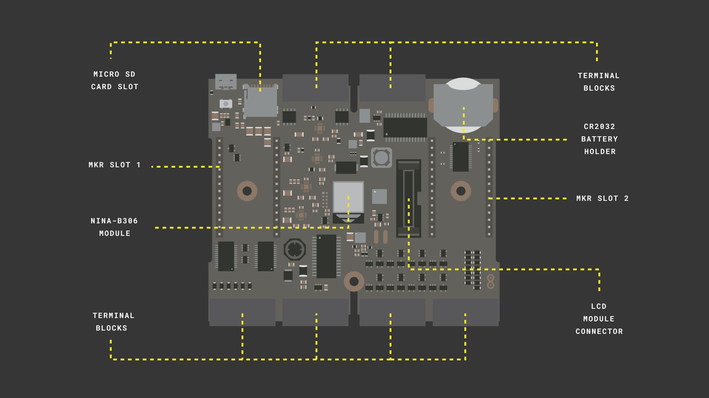

# Getting Started with the Edge Control
## Overview
The Edge Control board is a versatile tool that allows agriculturalists , creative and innovative solutions for Agriculture and technology. This tutorial will help you setup the development environment for the board and will cover the library and the API 

### You Will Learn
-   About the basic board topology 
-   How to power up the board 
-   About the [Arduino_EdgeControl.h](https://github.com/bcmi-labs/Arduino_EdgeControl) library 
-   About the core APIs used control the board

### Required Hardware and Software
-   Portenta H7 board (<https://store.arduino.cc/portenta-h7>)
-   USB C cable (either USB A to USB C or USB C to USB C)
-   Arduino IDE 1.8.10+  or Arduino Pro IDE 0.0.4+ 

## Instructions

In this Getting Started tutorial you will setup the Edge Control board and blink a LED in the Classic Arduino way. You will first download the Core from the library manager and write a simple blink sketch using some fundamental APIs provided by the Arduino Edge Control Library. You will need to connect your board to an external power source therefore have your LiPo Batteries or a power source close to you when running the sketch. 

### 1. Get to know the Board

The Arduino Edge Control board is designed to address the needs of precision farming. It provides a low power control system and modular connectivity allows you to adapt the board to your specific farming needs. The following images gives you an overview of some of the core features of the board that you need to be aware of  before you can get started with the board.  



**Terminal Blocks** allows you to connect upt **8** x **5V Analog Sensors**, **4** x **4-20mA sensors**, **16** x **Watermark Sensors**, **16** x **Latching Devices** like Motorized Valves and provides **4** x **configurable Solid State Relays**. 

***Note : Connections to the Terminal blocks are made through the Phoenix connectors included in the kit.***

**LCD Module Connector**  is used to attach the LCD module to the Edge Control Board through a flat cable.  

The Onboard **MKR slots 1 & 2** can be used to connect MKR boards to extend some capabilities such as connectivity through **LoRa, Wifi, 2G/3G/CatM1/NBIoT**, and Sigfox. 

The board includes both a **microSD card socket** and an additional **2MB flash memory** for data storage. Both are directly connected to the main processor via a SPI interface.

### 2. The Basic Setup

Before you start programming the Edge control board, you will have to download the [Mbed core](https://github.com/arduino/ArduinoCore-mbed) from the board manager. Open the **Board manager** and look for the `Edge Control` core. This board comes with the **Nina B306** processor which is the same processor used in other boards such as the **Nano 33 BLE**. 


### 3. The Blink.ino Sketch

Open a new sketch file `hello_edge_control.ino` and add the **Edge Control library**. This library provides acess to many of the different pins and functionalities belonging to the board. 

```cpp
#include<Arduino_EdgeControl.h>
```

Next, you need to ensure that the Serial communication has begun. Ensure that the board waits for at least 2.5 seconds before to guarantee that the communication has been established. Print a message on the Serial line with the text `Hello, Edge Control` 

```cpp
  // Start the timer 
  auto startNow = millis() + 2500;
  while (!Serial && millis() < startNow);
  Serial.println("Hello, Edge Control!");
```

The board is designed to be very low power and for this reason some the electronics are powered off by default. Once the serial communication has been established, we need to enable the power in the areas we want to use. The power tree below will give you an idea of the different power rails in the board. 


The edge control board uses an I/O Expander in order to increase the number of digital control signals. If we want to blink the on-board LED we would need to enable the power of the I/O expander in which the LED is connected to and also enable the power to the 5V DCDC converter. 

The `Power` class provides API access to enable the different voltage switches present on the board. In this tutorial we need to enable the 3V and 5V power lines using the `enable3V3()` and `enable5V()` power source. 

```cpp
// Enable power lines 
  Power.enable3V3();
  Power.enable5V();
```

Communication to the I/O Expander happens through the I2C port for which we will use the `Wire.begin(). We would also need to initialize the expander and configure the LED pin as OUTPUT. 

```cpp
// Start the I2C connection 
  Wire.begin();

  // Initalise the expander pins 
  Expander.begin();
  Expander.pinMode(EXP_LED1, OUTPUT);
```

inside the loop, you can use the `Expander.digitalWrite(pin, mode)` to control the LED via the I/O Expander as a normal GPIO.

```cpp
    Serial.println("Blink");
    Expander.digitalWrite(EXP_LED1, LOW);
    delay(500);
    Expander.digitalWrite(EXP_LED1, HIGH);
    delay(500);
```

***Tip: The Complete Sketch can be found in the Conclusions***

### 4. Connect To A Power Source 

The Valves require a power supply of 9 - 12 V and you can either use a power supply or a 3 cell lipo battery to provide the required voltage. Power sources can be connected to the onboard relay ports of the edge control board. Connect two jumper wires to the **GND** and **B** pins of the **Relay ports** 


Connect the jumper from the **B** pin to the positive terminal of the Battery and the jumper from the **GND** pin to the negative terminal of the battery 

### 5. Upload The Sketch 

Connect the board to your computer, upload the `blink.ino` sketch and open the **Serial Monitor**. If all the connections are done right, the LED blinks and you should be able to see the output  `Hello Edge Control` and `Blink` on the serial monitor. 

## Conclusion
This tutorial explains how to setup your Edge Control Board and the core operations of the Edge Control board.

### Complete Sketch 

```cpp
#include<Arduino_EdgeControl.h>

void setup() {
  Serial.begin(9600);

  // Start the timer 
  auto startNow = millis() + 2500;
  while (!Serial && millis() < startNow);
  Serial.println("Hello, Edge Control Sketch!");

  // Enable power lines 
  Power.enable3V3();
  Power.enable5V();

  // Start the I2C connection 
  Wire.begin();

  // Initalise the expander pins 
  Expander.begin();

  // Set the Pinmode of the onboard LED as OUTPUT
  Expander.pinMode(EXP_LED1, OUTPUT);

}

void loop() {
    
    // put your main code here, to run repeatedly:
    Serial.println("Blink");
    Expander.digitalWrite(EXP_LED1, LOW);
    Expander.digitalWrite(EXP_LCD_D7, HIGH);
    delay(500);
    Expander.digitalWrite(EXP_LED1, HIGH);
    Expander.digitalWrite(EXP_LCD_D7, LOW);
    delay(500);

}
```

### Next Steps

We  are developing new tutorials on how to connect Valves, LCDs, Water mark sensors and many other functionalities of the board. In the mean time you can explore the Arduino Edge Control library to develop your own application 

**Authors:** XX, YY
**Reviewed by:** ZZ [18.03.2020]  
**Last revision:** AA [27.3.2020]
