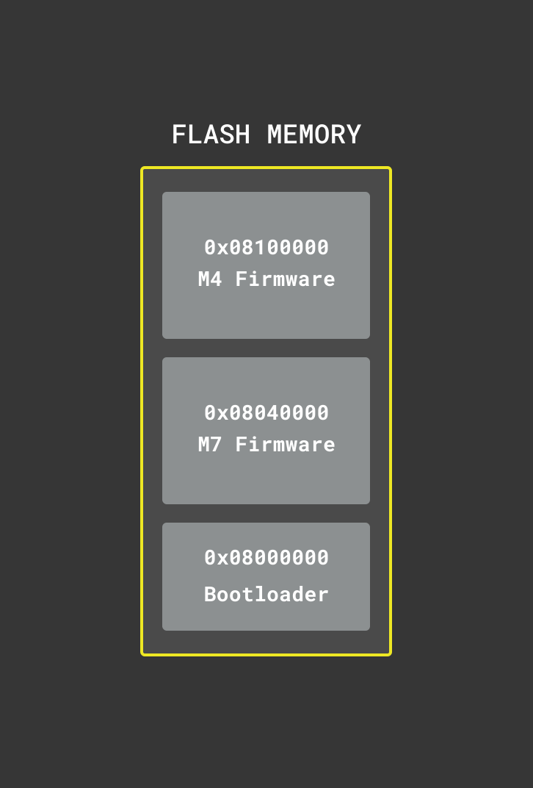
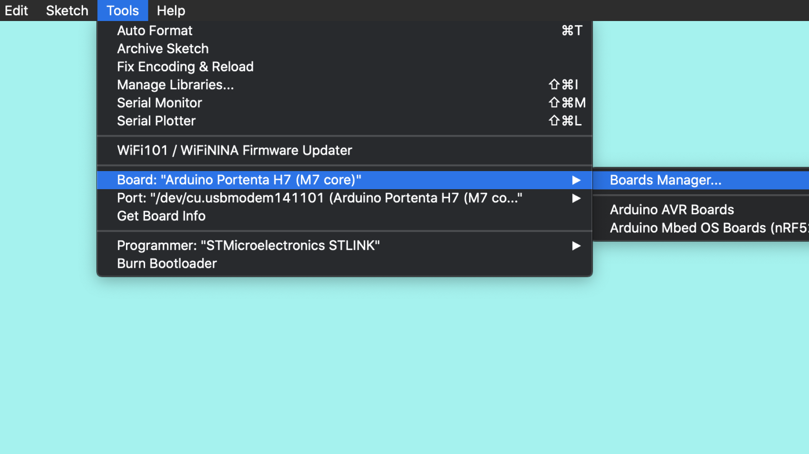
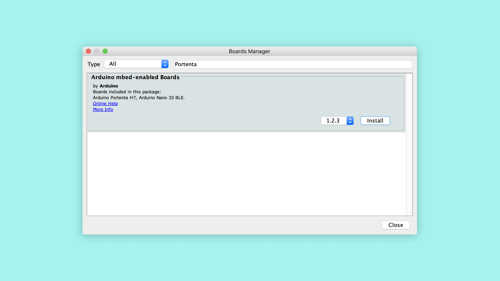

# Updating the Portenta Bootloader
This tutorial will explain what a bootloader is, why you should consider keeping it updated and how you can update it. The portenta also features a second ST ROM bootloader which is a separate mechanism that we don't cover in this tutorial. For the remainder of this tutorial, when we reference a bootloader, the custom bootloader provided by Arduino is meant.

## What You Will Learn
-   The concept of a bootloader
-   How to use the Arduino IDE board manager to update the Portenta core
-   How to use the Arduino IDE to update the Portenta bootloader to the lastest version

## Required Hardware and Software
-   Portenta H7 board (<https://store.arduino.cc/portenta-h7>)
-   USB C cable (either USB A to USB C or USB C to USB C)
-   Arduino IDE 1.8.10+  or Arduino Pro IDE 0.0.4+ 

#  What is a Firmware?

In order to understand how a bootloader works we first need to understand what a firmware is in the world of Arduino. A firmware consists of your sketch (.ino file) plus a couple of files and libraries that give you access to the hardware functions. Those files and libraries together make a bundle that is called a **core**. If you ever wondered what exactly `digitalwrite(pin, HIGH)` does under the hood, the core is the place where you need to look. That also explains why the different hardware architectures on the different Arduino boards need a separate core. Because the hardware level implementation of a function like `digitalWrite ` is hardware specific.

# What is a Bootloader?

A bootloader is a small application that gets started when an Arduino board gets powered. When you order an official Arduino board it comes pre-flashed with a bootloader.

The bootloader helps to upload a new sketch to the board. If the bootloader wasn't there you would need an external programmer device to upload your sketch to the board. The bootloader determines whether it should upload a new firmware or if it should launch an existing one that was uploaded previously. If you don't take any action the bootloader launches an existing firmware. On the other hand, when you double press the reset button on the board the bootloader recognizes that and waits for a firmware to be uploaded. The bootloader then takes care of storing the new firmware in the memory.

## Memory Layout

Both the bootloader and the firmware have predefined (but adjustable) locations in the memory where they get stored. In the end, the processor needs to know where to find the instructions to do its work. On the Portenta for example the bootloader is stored at the flash memory address `0x08000000`. When the board gets powered on it will jump to this location and start to do its job. The bootloader in turn knows that e.g. for the M7 the firmware can be found at location `0x08040000` so it will jump there if it doesn't need to upload a new firmware.

# Flashing the Latest Bootloader
Even though the Arduino boards come pre-flashed with a bootloader there are sometimes improvements or bug fixes which get integrated into an updated bootloader version. To benefit from that it makes sense to update it when there is a new version.

## 1. Updating the Core
New versions of the bootloader normally get shipped together with the core. That means you first have to update the core before you can update the bootloader. To do so open the board manager in the menu under *Tools->Board->Boards Manager...*

In the board manager and search for "portenta".  Find the Arduino mbed-enabled Boards package and click on "Install" to install the latest version of the mbed core (1.2.3 at the time of writing this tutorial).

## 2. Updating the Bootloader
-> Lenard

# Conclusion
-> Lenard

# Next Steps
-   -> Lenard

# Troubleshooting
## Sketch Upload Troubleshooting
-> Lenard

**Authors:** Sebastian Romero, Lenard George  
**Reviewed by:** Lenard George [7.10.2020]  
**Last revision:** Sebastian Romero [7.10.2020]