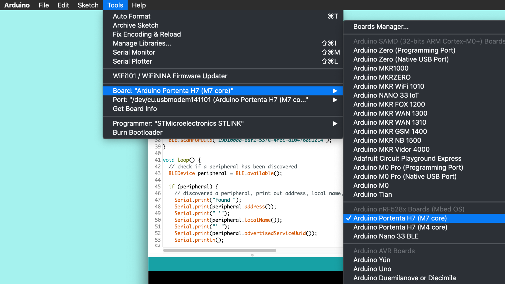
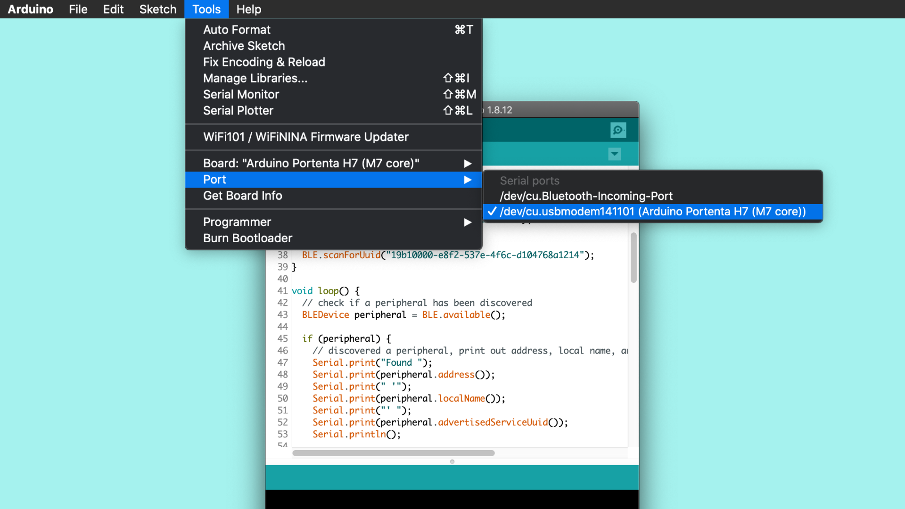

# BLE on the Portenta H7 For Arduino
In this tutorial we will enable low energy bluetooth (BLE) on the Portenta H7 to allow an external bluetooth device to control the on-board LED either by turning it on or off. 

## What you will learn

-   Enabling the BLE on the Protenta H7.
-   Connecting the Portenta to an external BLE Mobile Application (In this case [nrfconnect](https://www.nordicsemi.com/Software-and-tools/Development-Tools/nRF-Connect-for-mobile) by Nordic Semiconductor).

## Required hardware and software

-   Portenta H7 board (<https://store.arduino.cc/portenta-h7>)
-   USB C cable (either USB A to USB C or USB C to USB C)
-   Arduino IDE 1.8.13+  or Arduino Pro IDE 0.0.4+ 
-   [nRFconnect](https://www.nordicsemi.com/Software-and-tools/Development-Tools/nRF-Connect-for-mobile) or equivalent tool downloaded on your mobile device
    -   [nrfconnect for iOS](https://itunes.apple.com/us/app/nrf-connect/id1054362403?ls=1&mt=8) or [nrfconnect for android](https://play.google.com/store/apps/details?id=no.nordicsemi.android.mcp)

# Portenta and Low Energy Bluetooth (BLE) 
The wifi/bluetooth module on board the H7 offers a low energy bluetooth module that gives the board the flexibility to be connected to devices with strict power consumptions. Compared to Classic Bluetooth, Low Energy Bluetooth is intended to provide considerably reduced power consumption and cost while maintaining a similar communication range. This helps in rapid integration to final solution.  

https://www.bluetooth.com/specifications/gatt/characteristics/)


# Configuring the Development Environment
To communicate with the Portenta H7 via bluetooth, we are going to start by uploading a pre-built sketch that starts a bluetooth network and connects to your mobile device which will be used to control the LEDs. The sketch uses the [ArduinoBLE](https://www.arduino.cc/en/Reference/ArduinoBLE) Library that enables the BLE module and handles important functions such as scan, connect and interact with servics provided by other devices. You will also be using a third party application, [nRFconnect](https://www.nordicsemi.com/Software-and-tools/Development-Tools/nRF-Connect-for-mobile)  running on your mobile device that will connect your device to the board and help you control the on board LED.


*** NOTE :- //suggest some other BLE Scanning tools  *** 

## 1. The basic setup

Begin by plugging in your Portenta board to the computer using a USB-C cable and open the Arduino IDE or the Arduino Pro IDE. If this is your first time running Arduino sketch files on the board, we suggest you check out how to [set up the Portenta H7 for Arduino](https://github.com/bcmi-labs/arduino-pro-content/blob/master/content/tutorials/portenta-h7/por-ard-usb/por-ard-gs) before you proceed.


## 2. Install the ArduinoBLE library 

You will need to install the ArduinoBLE library on your Arduino IDE you are using. For this example we will use the Regular Arduino IDE. To install the library go to : **File -> Manage Libarary ->** type **ArduinoBLE**  and click **Install**.


## 3. Add the BLE sketch

Let's program the Portenta with the classic blink example to check if the connection to the board works. Copy and paste the following code into a new sketch in your IDE. 

```

#include <ArduinoBLE.h>

BLEService ledService("19b10000-e8f2-537e-4f6c-d104768a1214"); // BLE LED Service

// BLE LED Switch Characteristic - custom 128-bit UUID, read and writable by central
BLEByteCharacteristic switchCharacteristic("19b10000-e8f2-537e-4f6c-d104768a1214", BLERead | BLEWrite);

const int ledPin = LED_BUILTIN; // pin to use for the LED

void setup() {
  Serial.begin(9600);
  //while (!Serial);   // Uncomment to wait for serial port to connect.

  // Set LED pin to output mode
  pinMode(ledPin, OUTPUT);
  digitalWrite(ledPin, HIGH);

  // Begin initialization
  if (!BLE.begin()) {
    Serial.println("starting BLE failed!");
    digitalWrite(LEDR, LOW);
    delay(1000);
    digitalWrite(LEDR, HIGH);

    // Stop if BLE couldn't be initialized.
    while (1);
  }

  // Set advertised local name and service UUID:
  BLE.setLocalName("LED-Portenta-01");
  BLE.setAdvertisedService(ledService);

  // Add the characteristic to the service
  ledService.addCharacteristic(switchCharacteristic);

  // Add service
  BLE.addService(ledService);

  // Set the initial value for the characeristic:
  switchCharacteristic.writeValue(0);

  // start advertising
  BLE.advertise();
  digitalWrite(LEDB, LOW);
  delay(1000);
  digitalWrite(LEDB, HIGH);
  Serial.println("BLE LED-Distance-Control");
}

void loop() {
  // Listen for BLE peripherals to connect:
  BLEDevice central = BLE.central();

  // If a central is connected to peripheral:
  if (central) {
    Serial.print("Connected to central: ");
    // Print the central's MAC address:
    Serial.println(central.address());
    digitalWrite(ledPin, HIGH);
    delay(100);
    digitalWrite(ledPin, LOW);
    delay(100);
    digitalWrite(ledPin, HIGH);

    // While the central is still connected to peripheral:
    while (central.connected()) {
      // If the remote device wrote to the characteristic,
      // Use the value to control the LED:
      if (switchCharacteristic.written()) {
        if (switchCharacteristic.value()) {   // Any value other than 0
          Serial.println("LED off");
          digitalWrite(ledPin, HIGH);         // Will turn the Portenta LED off, weird
        } else {                             
          Serial.println("LED on");
          digitalWrite(ledPin, LOW);          // Will turn the Portenta LED on, weird
        }
      }
    }

    // When the central disconnects, print it out:
    Serial.print("Disconnected from central: ");
    Serial.println(central.address());    
    digitalWrite(ledPin, HIGH);
    delay(100);
    digitalWrite(ledPin, LOW);
    delay(100);
    digitalWrite(ledPin, HIGH);
  }
}

```

In our example we use a pre-defined bluetooth number code pre-setup for controlling a devices LED's. This code can also be referred to as [GATT codes](https://www.bluetooth.com/specifications/gatt/services/), which defines how two bluetooth low energy devices tranfer data. Once a connection is established with a device, its respecitve GATT code, which is a 16 bit ID, is stored in a lookup table for future reference. 

```BLEService ledService("19b10000-e8f2-537e-4f6c-d104768a1214"); // BLE LED Service```

These GATT codes are very long, but in our example it is always the same code. 

*** NOTE :- Reminder that on the Portenta the onboard LED is turn on by setting digitalWrite to LOW and off by setting digitalWrite to HIGH, reverse of non-pro Arduinos. This arraingment is safer for the board as a way to protect the board LED. ***  

## 4. Upload the sketch 

Double press the reset button so the on-board LED is slowly pulsing green. Then, select your board from **Tools** ->  **Board** -> **Arduino Portenta H7 (M7 core)** 
 

Then choose the **Port** and **Upload** the file to your Portenta board. Open the Serial Monitor once you've **uploaded** the code to the board. 



## 5. Connect an external device

Once you have downloaded the nRF application on your mobile device, and look for your portenta 

- On your mobile device load *nrfconnect* or ewuivalent and scan for the BLE connection called "LED..."
- connect with the device, find the 2 way communication tabs and type either "00" or "01" to turn the LED on or off

# Conclusion
If all went well you have proved that you can connect your Portenta with your cell phone and have some communication abilities between the two devices  

# Next Steps  

Now that you learnt how to configure the Portenta as a BLE endpoint you can try with two Portentas (or other BLE capable Arduino devices) to facilitate bidirectional communication. More information on how to achieve that can be found on the [BLE library reference page](https://www.arduino.cc/en/Reference/ArduinoBLE)


# Troubleshooting
## Sketch Upload Troubleshooting
If trying to upload a sketch but you receive an error message, saying that the upload has failed you can try to upload the sketch while the Portenta H7 is in bootloader mode. To do so you need to double click the reset button. The green LED will start fading in and out. Try to upload the sketch again. The green LED will stop fading when the upload completes.

**Authors:** Jeremy Ellis, YY
**Reviewed by:** Lenard George [20.08.2020]  
**Last revision:** AA [27.3.2020]