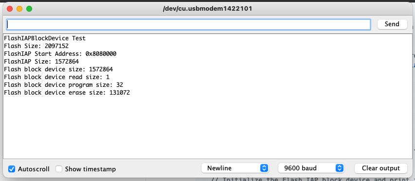

# Using the Flash on Portenta H7 – MCU

In this tutorial we will use the internal flash memory of the microcontroller of Portenta H7 and other MbedOS-based Arduino boards (Nano 33 BLE andNano 33 BLE Sense). This is Part 1 of a series of projects on how to use the flash memories on the MbedOS-based Arduino boards. 

## What You Will Learn
-   To use the Flash In-Application Programming Interface 
-   To calulate the size of the flash memory 

## Required Hardware and Software
-   Portenta H7 board (<https://store.arduino.cc/portenta-h7>)
-   USB C cable (either USB A to USB C or USB C to USB C)
-   Arduino IDE 1.8.10+  or Arduino Pro IDE 0.0.4+ 


# Configuring the Development Environment

The H7 comes with 2 Mbytes of Flash memory with read-while-write support + 1 Mbyte of RAM. To support the use of non-eraseble memory, a part of the flash memory can be programmed to behave as a block device that can behave as a place to store information. 

To to access the internal flash of the MCU, you will have to use the [Flash In-Application Programming Interface (FlashIAP)](https://os.mbed.com/docs/mbed-os/v6.4/apis/flash-iap.html). This API creates a block device on top of the space still available on the flash after flashing your sketch. Keep in mind  that **the free space** available for the FlashIAP block device **depends on** the space occupied by **the complete sketch** on the flash plus a few **block alignments calculations**.
Once the block device has been created, you can use a raw access API to save and load data on it. 

When saving and reading data from the flash memory, we need to be aware of the **flash r/w limits** while using raw/direct access: flash memories have a limited amount of write cycles. Typical flash memories can perform about 10000 writes cycles to the same block before starting to "wear out" and begin to lose the ability to retain data. **You can actually render your board useless with improper use of this example and described APIs.**

[note]

**Note :** It is recommended to **limit** the usage of FlashIAP block devices to **once-in-a-time** read and write **operations**, for example, for managing `setup()`-time configuration parameters.

[/note]

## 1. The Basic Setup

Begin by plugging in your Portenta board to the computer using a USB-C  cable and open the Arduino IDE or the Arduino Pro IDE. If this is your first time running Arduino sketch files on the board, we suggest you  check out how to [set up the Portenta H7 for Arduino](por-ard-gs) before you proceed.


## 2. Define the FlashIAPLimits.h 

Let's start by creating a sketch named `FlashStorage_MbedOS.ino` file . Then, let's define the helper functions for calculating limits for the FlashIAP block device. These helper functions will be stored in a header file called **FlashIAPLimits.h** that we will need to create by clicking on the down arrow just below the Serial Monitor icon in the IDE and selecting "New Tab". 

```cpp
/**
   Helper functions for calculating limits for the FlashIAP block device
 * */

#pragma once

#include <Arduino.h>
#include <FlashIAP.h>
#include <FlashIAPBlockDevice.h>

using namespace mbed;

// An helper struct for FlashIAP limits
struct FlashIAPLimits {
  size_t flash_size;
  uint32_t start_address;
  uint32_t aval_size;
};

// Get the actual start address and available size for the FlashIAP Block Device
// considering the space already occupied by the sketch.
FlashIAPLimits getFlashIAPLimits()
{

  auto align_down = [](uint64_t val, uint64_t size) {
    return (((val) / size)) * size;
  };
  auto align_up = [](uint32_t val, uint32_t size) {
    return (((val - 1) / size) + 1) * size;
  };

  size_t flash_size;
  uint32_t flash_start_address;
  uint32_t start_address;
  FlashIAP flash;

  auto ret = flash.init();
  if (ret != 0)
    return { };

  // Find the start of first sector after text area
  int sector_size = flash.get_sector_size(FLASHIAP_APP_ROM_END_ADDR);
  start_address = align_up(FLASHIAP_APP_ROM_END_ADDR, sector_size);
  flash_start_address = flash.get_flash_start();
  flash_size = flash.get_flash_size();

  ret = flash.deinit();

  int aval_size = flash_start_address + flash_size - start_address;
  if (aval_size % (sector_size * 2)) {
    aval_size = align_down(aval_size, sector_size * 2);
  }

  return { flash_size, start_address, aval_size };
}
```


## 3. Create the FlashStorage_MbedOS.ino

Once we have created the header tab, let's modify the main ta of our sketch by adding the FlashIAP support with the relevant library as follows:

```
#include <FlashIAPBlockDevice.h>
```

Copy paste the following code inside `void setup()` 

```cpp
void setup()
{
Serial.begin(115200);
  while (!Serial);

//  Wait for terminal to come up
  delay(1000);

Serial.println("FlashIAPBlockDevice Test");

// Feed the RNG for later random content generation
  srand(micros());
}
```


## 4. Adding the Flash IAP Libraries 

Then, we need to complete the program with some specific statements that we will explain step by step below:

First, we need to get a few helpers from the supporting header file:

```
#include "FlashIAPLimits.h"
```

Let's continue by editing the `void setup()`function with placing the next line of code just following the `srand(micros());`statement we added some steps above. This header file defines the `getFlashIAPLimits` function that will take care of calculating the starting point and the size of the flash storage available on the flash.

```
auto [flash_size, start_address, iap_size] = getFlashIAPLimits();
```

## 5. Intialise the Block Device 

Now,  let's create the block device using the calculated limits. Initialize the block device before reading or write data.

```
FlashIAPBlockDevice bd(start_address, iap_size);
bd.init();
```

Remember always to **allocate** a **flash-erase-size-wide** storage area to read and write data from the flash:

```
const size_t size { bd.get_erase_size() };
char buffer[size] {}; 
bd.read(buffer, 0, size);
```

Don't forget to **erase** the flash block **before** being able to **program** it with your data, i.e. to write data on it (that's the way flash memories work):

```
 bd.erase(0, size);
 bd.program(buffer, 0, size);
```

De-init the block-device when done:

```
bd.deinit(); 
```

With this line of code, we have finished our program, in which the ` void loop()`function will remain empty. 

[note]

**Note :** **The data stored** on the flash memory will be **erased** at every **sketch upload** and will only be **retained** only through successive sketch executions, e.g. after **power cycling** or **resetting** the board.

[/note]

The complete sketch file  

``` cpp
/**
 * A minimal example to demonstrate the use of the MCU's internal flash memory for
 * the Arduino boards based on MbedOS (Portenta H7, Nano 33 BLEs).
 * 
 * The sketch uses the Flash In Application Programming API to create a block device
 * on the space still available on the flash.
 * 
 * WARNING! Please, always be aware of the r/w limits while using raw/direct access to the flash.
 * 
 * Read more about the MbedOS' Flash In Application Programming API at
 * https://os.mbed.com/docs/mbed-os/v6.4/apis/flash-iap.html
 * 
**/
 
#include "FlashIAPLimits.h"
#include <FlashIAPBlockDevice.h>

using namespace mbed;

void setup()
{
  Serial.begin(115200);
  while (!Serial);

  //  Wait for terminal to come up
  delay(1000);

  Serial.println("FlashIAPBlockDevice Test");

  // Feed the RNG for later random content generation
  srand(micros());

  // Get limits of the the internal flash of the microcontroller
   auto [flash_size, start_address, iap_size] = getFlashIAPLimits();

  Serial.print("Flash Size: ");
  Serial.println(flash_size);
  Serial.print("FlashIAP Start Address: 0x");
  Serial.println(start_address, HEX);
  Serial.print("FlashIAP Size: ");
  Serial.println(iap_size);

  // Create a block device on the available space of the flash
  FlashIAPBlockDevice bd(start_address, iap_size);

  // Initialize the Flash IAP block device and print the memory layout
  bd.init();
  Serial.printf("Flash block device size: %llu\n", bd.size());
  Serial.printf("Flash block device read size: %llu\n", bd.get_read_size());
  Serial.printf("Flash block device program size: %llu\n", bd.get_program_size());
  Serial.printf("Flash block device erase size: %llu\n", bd.get_erase_size());

  const size_t size { bd.get_erase_size() };
  char buffer[size] {};

  // Read back what was stored at previous execution
  bd.read(buffer, 0, size);
  Serial.printf("%s\n", buffer);

  // Write an updated message to the first block
  sprintf(buffer, "Hello World @ %d!\n", rand());
  bd.erase(0, size);
  bd.program(buffer, 0, size);

  // Deinitialize the device
  bd.deinit();
}

void loop()
{
}
```


## 6. Upload the Code

Once you have uploaded the sketch to the board, open the Serial Monitor when the board starts it will display information about the flash memory.



# Conclusion

This tutorial shows a  minimal example to demonstrate the use of the MCU's internal flash memory for the Arduino boards based on MbedOS (Portenta H7, Nano 33 BLE and Nano BLE Sense).

**Authors:** Giampaolo Mancini
**Reviewed by:** Lenard [20.12.2020]  
**Last revision:** Jose Garcia [18.01.2021]

