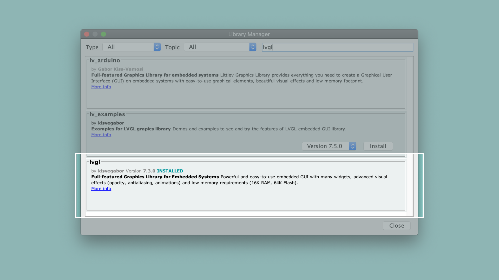

# Creating GUIs With LVGL  
In this tutorial you will learn to use [LVGL](https://lvgl.io/) to create a simple graphical user interface that consists of a button with an inner text label that updates itself.

## What You Will Learn
-   Understanding the structure to build LVGL interfaces.
-   Building a simple UI with a text label and a button. 
-   Configuring the setup to display the User-Interface. 

## Required Hardware and Software
-   Portenta H7 board (<https://store.arduino.cc/portenta-h7>)
-   USB C cable (either USB A to USB C or USB C to USB C)
-   Arduino IDE 1.8.10+  or Arduino Pro IDE 0.0.4+ 
-   USB-C hub with HDMI ([The one we used](https://www.dustinhome.se/product/5011166993/travel-port-usb-c-total))
-   External monitor 
-   HDMI cable 

# The Light and Versatile Graphics Library

Graphical User interfaces are necessary for visualising information and interacting with certain aspects of an application. The Light and Versatile Graphics Library, also known as [LVGL](https://lvgl.io/), is an open-sourced library used to create graphical user-interfaces for microcontrollers and high-end processors. The light weight embedded library provides all the necessary widgets and user interface elements that will allow you to easily create user interfaces for displays like OLED, TFT, monitors, Drive Monochrom and touch screens.

# Building a simple GUI 

This tutorial will guide you to build a basic user interface using LVGL and the USBhost Library that you will have download using the Arduino Library Manager. The setup for this tutorial requires you to first to upload the finished sketch file to the Portenta board where it converts the board into a USB host Device. You will then connect the board to a USB-hub to in order to connect it to an external monitor. Once the hub is powered externally, a graphical user interface with a button and a text-field will be displayed on the screen.


## 1. The Basic Setup

Begin by plugging your Portenta board into the computer using a USB-C cable and open the Arduino IDE or the Arduino Pro IDE. If this is your first time running Arduino sketch files on the board, we suggest you check out how to [set up the Portenta H7 for Arduino](https://github.com/bcmi-labs/arduino-pro-content/blob/master/content/tutorials/portenta-h7/por-ard-usb/por-ard-gs) before you proceed.


## 2. Download the lvgl library

Next, select *Portenta* in the **Tools -> Board** menu before installing [lvgl](https://github.com/lvgl/lvgl) from the Library Manager. To do so, go to **Sketch** **->** **Include Libraries** **-> Manage Libraries** and search for *LVGL*. Download **lvgl by [kisvegabor](https://github.com/kisvegabor)**.  



   ***Make sure you have selected the right board inside Tools -> Board, otherwise you won't see the library in the examples menu .***

## 3. Add the button widget  

Let's start by including the libraries that we are going to use.

```cpp
#include "Portenta_LittleVGL.h"
#include "USBHost.h"
```

Create a custom button widget using the `button` object. This object allows for an inner label, which text can easily be configured. The following lines of code initialise the button variable and its label, you can add them at the beginning of your sketch.

```cpp
static lv_obj_t *button;
static lv_obj_t *label;
```

Then inside the `setup()` configure the type, style and the position of the button.

```cpp
void setup() {
  Serial.begin(9600);
  
  // Initialize Portenta's video interface
  portenta_init_video();

  // Setting up the Button
  button = lv_btn_create(lv_scr_act(), NULL);

  // We move it to the center of the screen and align it centered
  lv_obj_align(button, NULL, LV_ALIGN_CENTER, 0, -40);

  // If you want to handle the button’s click event register an event_handler callback function
  //lv_obj_set_event_cb(button, event_handler);

  // Setting up the label making it a child of the button
  label = lv_label_create(button, NULL);

  // Set the label's text
  lv_label_set_text(label , "Click Here");
}
```

To finish, in the loop function add `lv_task_handler()` which will execute any pending tasks. This will update the user interface. 

```cpp
void loop() {
  // put your main code here, to run repeatedly:
  lv_task_handler();
}
```

This sketch creates a button that will be displayed in the monitor. The `button` object represents our button and the `label` object is used to add a text to the button.

## 4. Connect an external monitor

Compile and upload the sketch to your Portenta H7. At this point your board becomes the host. Unplug the board from your computer and connect it to the USB-hub along with a monitor that is connected to the HDMI port. Power up your hub by connecting it to an external power source and the monitor will display a button with the label `Click Here`. 

   

   ***If you aren't familiar how the USB host works, we recommend you to have a look at the [USB Host tutorial](https://www.arduino.cc/pro/tutorials/portenta-h7/por-ard-usb )***

Our button object currently has LVGL's default style. If you want to customise the button's style you can have a look at LVGL's documentation <https://docs.lvgl.io/latest/en/html/widgets/btn.html#simple-buttons>

## 5. Create a simple counter

Once you know that it is working, let's create a counter that increases each second and update it in the screen. To do so, we will create a label that is going to be updated periodically and then change its value in the screen, this is possible using the LVGL feature called 'Task'. 

First we create a counter variable at the beginning of the program (before the `setup()` function).

```cpp
uint32_t counter = 0;
```

Then we create the function that is going to update the value of the counter and its label. Add it to the sketch just before the `setup()` function.

```cpp
static void updateCounterTask(lv_task_t *task) {
  // Print the count to the Serial monitor
  Serial.println(counter);

  // Update the text of the label
  lv_label_set_text_fmt(label, "%d" , counter);    
  
  // Increase the count number
  counter++;                                               
}
```

Finally, as the last line inside the `setup()` function, we create the task that calls our `updateCounterTask()` function every second.

```cpp
 // Create a task to update the counter
lv_task_create(updateCounterTask, 1000, LV_TASK_PRIO_MID, NULL);
```

## 6. Upload the Sketch

This is the complete sketch of the tutorial that updates the button text with a counter. Upload the sketch to your Portenta H7 and connect it to an external monitor as described in Step 4. 

```cpp
#include "Portenta_LittleVGL.h"
#include "USBHost.h"

static lv_obj_t *button;
static lv_obj_t *label;

uint32_t counter = 0;

static void updateCounterTask(lv_task_t *task) {
  // Print the count to the Serial monitor
  Serial.println(counter);

  // Update the text of the label
  lv_label_set_text_fmt(label, "%d" , counter);    
  
  // Increase the count number
  counter++;                                               
}

void setup() {  
  Serial.begin(9600);
  
  // Initialize Portenta's video interface
  portenta_init_video();

  // Setting up the Button
  button = lv_btn_create(lv_scr_act(), NULL);

  // We move it to the center of the screen and align it centered
  lv_obj_align(button, NULL, LV_ALIGN_CENTER, 0, -40);

  // If you want to handle the button’s click event register an event_handler callback function
  //lv_obj_set_event_cb(button, event_handler);

  // Setting up the label making it a child of the button
  label = lv_label_create(button, NULL);

  // Set the label's text
  lv_label_set_text(label , "Click Here");

  // Create a task to update the counter
  lv_task_create(updateCounterTask, 1000, LV_TASK_PRIO_MID, NULL);
}

void loop() {
  // put your main code here, to run repeatedly:
  lv_task_handler();
}
```

# Conclusion

This tutorial shows how to build a simple user interface with your Portenta. Starting with a static view in the monitor and then converting it into a simple dynamic application that features an updating variable on the screen. The tutorial also shows how to  use the "task" feature of LVGL to run instructions recurrently.

# Next Steps
Now that you know how to build a simple UI for a screen, you can try to add more labels to the screen to show different stuff. Also be alerted because we will continue growing the tutorials about how to combine LVGL with other features of your Portenta.

# Troubleshooting
## Not updating the text with the count
* Make sure that the label and task are declared on top of the sketch, outside the `setup()` and `loop()` like a normal variable.
* Check if the task has the same structure in the first declaration and the function creation.
* Look inside the `loop()` and see if `lv_task_handler()` is there.
* Try to uncomment the `printf` inside the task to check if the Serial Monitor its updating the count.

## Sketch Upload Troubleshooting
* Make sure you set the board in bootloader mode, by clicking twice the reset button, then you should see the built-in LED fading.
* If you uploaded the sketch and you don't have any output in the display, make sure you have `portenta_init_video()` in the `setup()`.
* Unplug and plug back the HDMI cable.
* Reset the Portenta once it's connected to the USB-hub.

**Authors:** Pablo Marquínez & Lenard George  
**Reviewed by:** Jose Garcia, Manuel Zomer [2021-01-27]  
**Last revision:** Sebastian Romero  [2021-02-03]