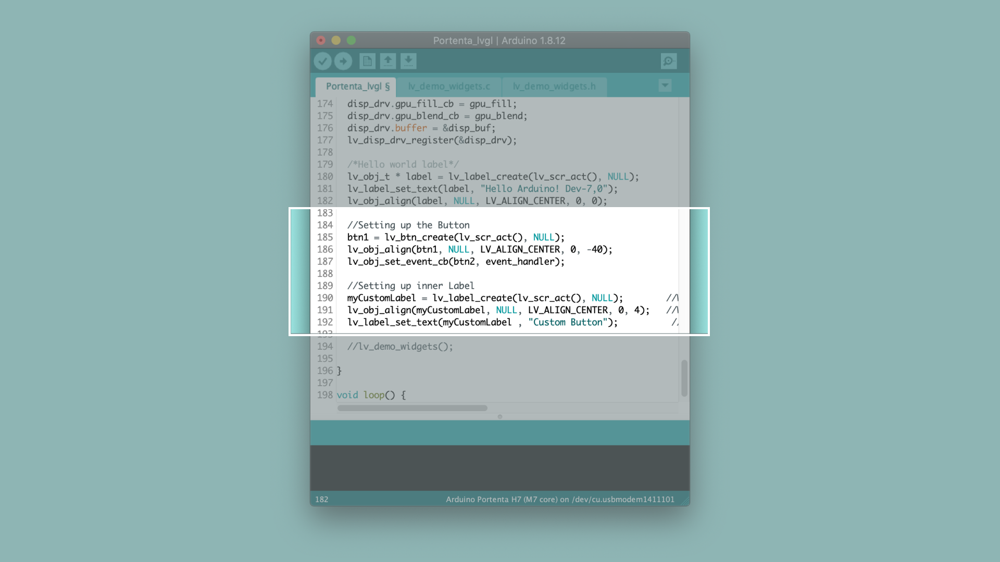

# Creating GUIs With LVGL  


1. The Basic Setup

   Begin by plugging in your Portenta board to the computer using a USB-C cable and open the Arduino IDE or the Arduino Pro IDE. If this is your first time running Arduino sketch files on the board, we suggest you check out how to [set up the Portenta H7 for Arduino](https://github.com/bcmi-labs/arduino-pro-content/blob/master/content/tutorials/portenta-h7/por-ard-usb/por-ard-gs) before you proceed.

2. Download the lvgl library

   To start with, you need to download the [lvgl Library](https://github.com/lvgl/lvgl) from the Library Manager. Go to **Sketch** **->** **Include Libraries** **-> Manage Libraries** and search for LVGL. Dowload the **lvgl library** by [kisvegabor](https://github.com/kisvegabor).  

   
   
   
   Once you have installed the library, create a new Sketch **File --> New**
   
   *** If you cant find the sketch, make sure you have selected the right board inside Tools > Boards ***

   

   Lets start by including the libraries that we are going to use.
   
   ```cpp
   #include "Portenta_LittleVGL.h"
   #include "USBHost.h"
   ```
   
4. Adding a Button widget 

   Lets add custom button widget using the `lv_btn` object, This object allows you to have an inner label whose text can be easily configure. The following lines of code initialises the button variable and its label which you can add it at the beginning of the sketch. 

   ```cpp
   static lv_obj_t *lv_btn;
   static lv_obj_t *myCustomLabel;
   ```

   


   Then at the end of the `setup()` you can configure the type, style and the position of the button.

   ```cpp
   //Setting up the Button
   lv_btn = lv_btn_create(lv_scr_act(), NULL);
   lv_obj_align(lv_btn, NULL, LV_ALIGN_CENTER, 0, -40);
   //lv_obj_set_event_cb(lv_btn, event_handler);               //If you want to handle the button's callback create a cb_btn function
   
   //Setting up inner Label
   myCustomLabel = lv_label_create(lv_scr_act(), NULL);        //We make the object be a label widget
   lv_obj_align(myCustomLabel, NULL, LV_ALIGN_CENTER, 0, -40);   //We move it to the center of the screen below the 'Hello world' and align centered
   lv_label_set_text(myCustomLabel , "Custom Button");          //We set the default text
   ```

   

   Compile and Upload the sketch to your board. Connect the board to the USB hub with the Monitor attached to the HDMI port.  Once you power up the HUB, you will see a button with a label **CustomLabel**.

   
4. Connect an external monitor

   Compile and upload the sketch, to your Portenta H7. At this point your board becomes as the host. Unplug the board from your computer and connect it to USB hub along with a monitor that is connected to the HDMI port. Power up your hub by connecting it to an external power source and the monitor will display a `Custom Button`. 

   

   *** If you arent familiar with how the USB host works, we recommend you to have a look at the [USB Host tutorial](https://www.arduino.cc/pro/tutorials/portenta-h7/por-ard-usb ) ***


5. Create a simple counter

   To make a counter we need to update periodically a label and change it value, to be able to do that we are going to use the LVGL feature called 'Task'. First of all lets declare our new task by adding function and an int to count

   ```cpp
   static void label_Task(lv_task_t * myTask);
   uint32_t count = 0;
   ```
   
   After that we need to create the void that we declared before:

   ```cpp
   static void label_Task(lv_task_t * myTask) {
      //printf("count: %d\n", count);                        //We can see in the Serial monitor the count
      lv_label_set_text_fmt(myCustomLabel, "%d" , count);    //Update the text from the label
      count++;      //Increase the count number
   }
   ```

   To make it work we need to take the task and add it inside the LVGL task handler, by adding  at the end `of the setup()`We set the task to refresh each second.

   ```cpp
    lv_task_create(label_Task, 1000, LV_TASK_PRIO_MID, NULL);
   ```

# Conclusion

in this tutorial you learned how to build a simple user interface for the Portenta H7 and the configuration required to view the

# Next Steps
-   

# Troubleshooting
## Not updating the text with the count
Make sure that the label and task is declared on top of the sketch, outside the `setup()`and `loop()` like a normal variable.

Check if the task has the same structure in the first declaration and the function creation.

Look inside the `loop()` and see if `lv_task_handler()` is there.

Try to uncomment the printf inside the task to check if the Serial Monitor its updating the count.


## Sketch Upload Troubleshooting
* Make sure you set the board in bootloader mode, by clicking twice the reset button, then you should see the built-in LED fading.

**Authors:** Pablo Marquinez & Lenard George
**Reviewed by:** ZZ [18.03.2020]  
**Last revision:** AA [27.3.2020]
