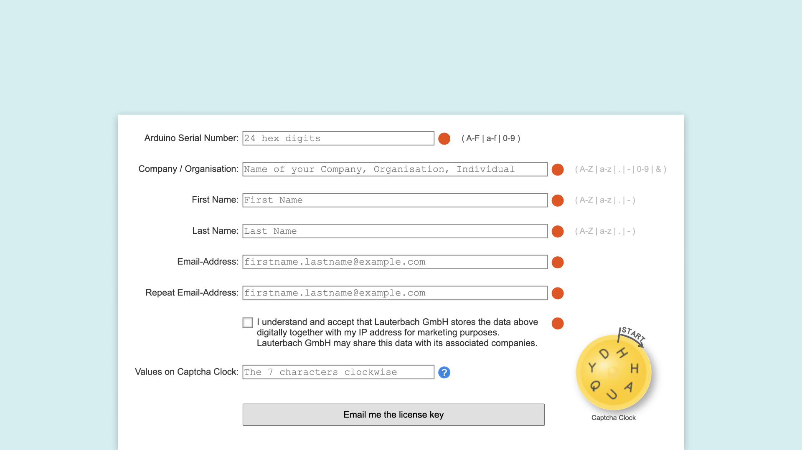
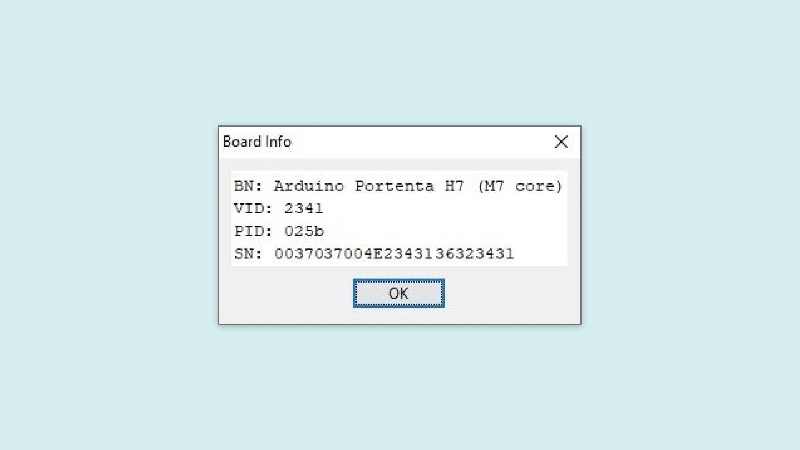
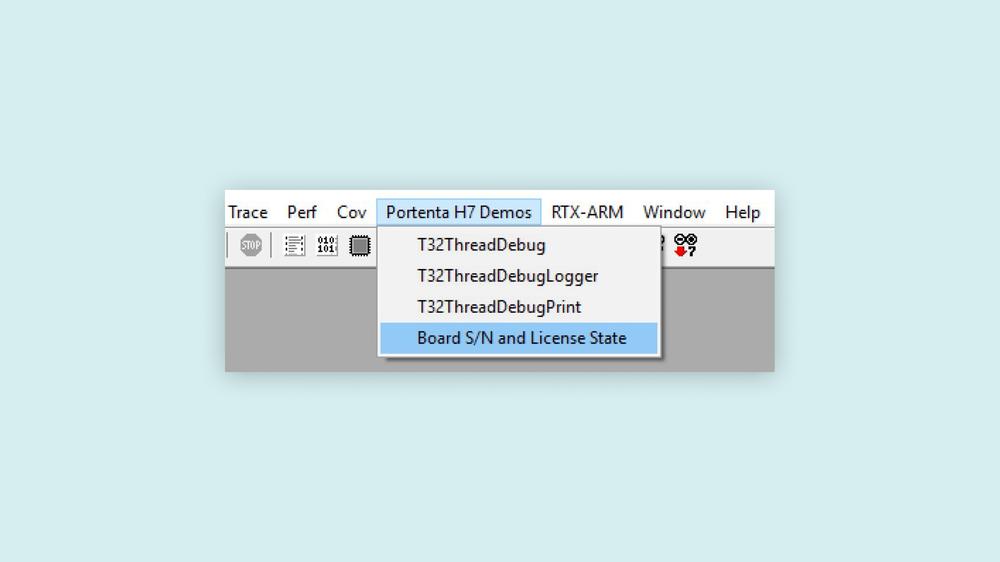
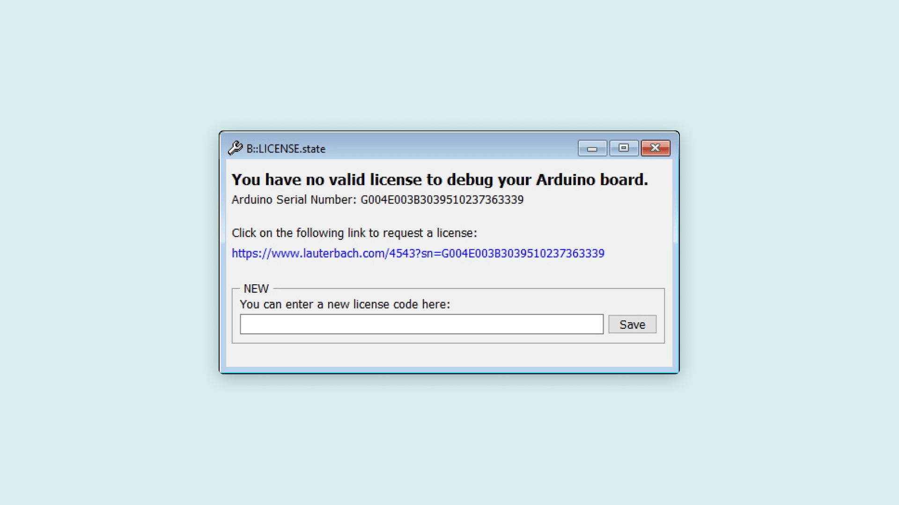
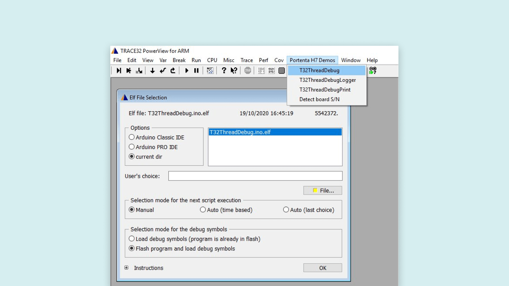
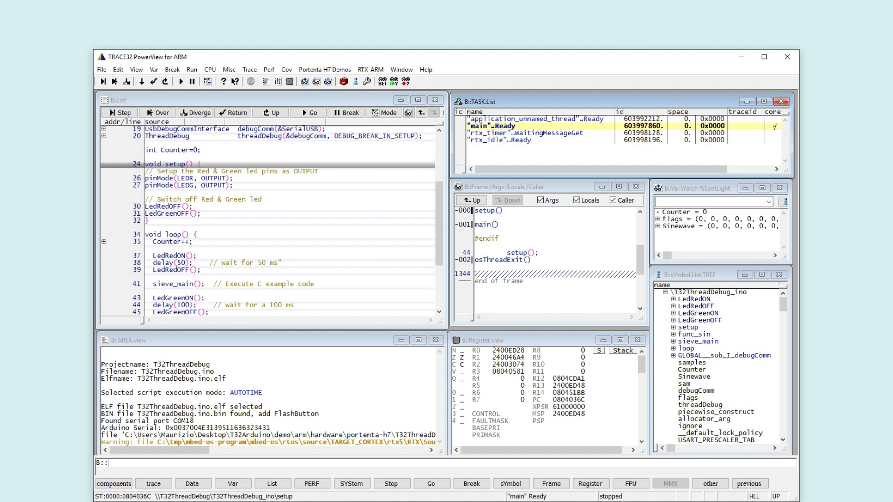

# Lauterbach TRACE32 GDB Front-End Debugger for Portenta H7
This tutorial will show you how to use the Lauterbach TRACE32 GDB front-end debugger to debug your Portenta H7 application via GDB on a serial interface. It also explains how to obtain a free one-year licence of a fully functional version of TRACE32 using your Portenta's serial number.

## What You Will Learn
-   How to get a free one-year license key for TRACE32 GDB Front End debugger for Portenta H7 - M7 core
-   How to download and start the Lauterbach TRACE32 GDB Front End debugger
-   How to flash and debug some ready-to-run demos

## Required Hardware and Software
-   Portenta H7 board (https://store.arduino.cc/portenta-h7)
-   USB C cable (either USB A to USB C or USB C to USB C)
-   Arduino IDE 1.8.13+ or Arduino Pro IDE 0.1.0+
-   Lauterbach TRACE32 (https://www.lauterbach.com/download_demo.html)

# TRACE32 GDB Front End Debugger

In this tutorial you will load an application on the Portenta H7 board which includes the Monitor for Remote Inspection (MRI). This is a GDB compatible serial monitor which is included in the ThreadDebug sketch in the Arduino IDE Examples for Portenta H7 (M7 core) and in all examples in the TRACE32/demo directory of the TRACE32 installation. Throughout this document **(INSTALLATION DIRECTORY)** is used as a place holder for the directory where you unzipped the TRACE32 software.

***This tutorial assumes that you have already installed the Arduino IDE or Arduino Pro IDE and configured it to support the Portenta H7 board. Please refer to [Setting Up Portenta H7 For Arduino](https://www.arduino.cc/pro/tutorials/portenta-h7/por-ard-gs) before you proceed.***

## 1. Downloading the TRACE32 Debugger

In order download the TRACE32 debugger open the [Lauterbach download page](https://www.lauterbach.com/download_demo.html) in your browser. Download the zip file named **Debugger for GDB target (Arduino Pro)**  which contains TRACE32 for Portenta-H7.

Extract the zip file to a directory of your choice. On Windows systems, please avoid C:\T32, because this is the default installation directory for the full TRACE32 distribution.

## 2. Registration and License Key

Without a valid license, the TRACE32 debugger only works for few minutes in demo mode. Lauterbach can generate a **free one-year license** based on the serial number of your Portenta H7 board. In order to obtain a license, please register here:

[www.lauterbach.com/4543](http://www.lauterbach.com/4543)

Enter the board's serial number (instructions below), your name and e-mail address and you will be sent your license key.



There are two alternative ways to detect the board serial number:

- In the Arduino IDE select the "Tools->Get Board Info" menu command after selecting the port to which the Portenta is connected to. This should show a 24 character (96 bit) long serial number.



***If you see a 16 character (64-bit) long serial number, then you need to update your Arduino IDE, the Arduino mbed-enabled Boards Core software in your board. Also, make sure your Portenta H7 has the [latest bootloader](https://www.arduino.cc/pro/tutorials/portenta-h7/por-ard-bl) installed. Details of how to do this can be found on the Arduino website.***

- Once you receive the email with the license key, follow the instructions provided at the end of the message: 
- Add the whole line of code provided to the file **license.t32** in your TRACE32 main directory.
  Create the file license.t32 if it does not yet exist. On Windows the TRACE32 system directory is by default "C:\T32".
  Please restart TRACE32 after adding the license key.
- Use the TRACE32 debugger. Check section "3. Start the TRACE32 Debugger" on how to start it. Click the menu item "Board S/N and License State". Your board's serial number will be printed in the AREA window and a dialog LICENSE.state will be opened.





Either copy & paste the displayed serial number manually to the Lauterbach registration page or click on the provided link in the dialog window.

Note: Newer TRACE32 software version should automatically detect and show the board serial number, at first attach to the target.

Once you receive the e-mail containing your licence key copy & paste it into a text file named `license.t32` and save it to the root directory of your TRACE32 installation.

## 3. Starting the TRACE32 Debugger

To use the debugger launch the appropriate executable for your host operating system. The executables can be found in the corresponding sub-directory for your operating system:

`(INSTALLATION DIRECTORY)/bin/windows` for 32bit Windows hosts

`(INSTALLATION DIRECTORY)/bin/windows64` for 64-bit Windows hosts

`(INSTALLATION DIRECTORY)/bin/linux` for 32-bit Linux hosts

`(INSTALLATION DIRECTORY)/bin/linux64` for 64-bit Linux hosts.

For easy access, we suggest creating a link to the corresponding executable file on your desktop:

- for Windows, this is t32marm.exe

- for Linux, this is t32marm-qt

### Setting Up the Serial Port

On Windows systems, the TRACE32 start-up script will automatically search for the right COM port attached to the Portenta H7 board.

On Linux systems, you will need to edit the system-settings.cmm file to manually add the serial port to connect to the Portenta H7 board. This is a text file and can be opened with your favorite text editor. Edit the line that defines &GDBPORT to refer to the serial port, for example: `&GDBPORT="/dev/ttyACM0"`. This must be done **before** you start the TRACE32 software. After changing the port you can start the TRACE32 debugger or re-start it in case it was open while you made the changes.

***The manual port setting is also useful for Windows systems where you have multiple Portenta H7 boards connected, and you want to select a specific board to be used by TRACE32 for debugging. The automatic port selection is disabled when a &GDBPORT definition is found in `system-settings.cmm`.***

## 4. Running Your First Demo

A number of pre-built demo programs are available .They can be accessed from the "Portenta H7 Demos" menu. The following instructions relate to the T32ThreadDebug example. However, the other examples follow a similar pattern.

The demo directory already includes the symbolic file (.elf) for debugging and the binary file (.bin) for flash programming.


### ELF File Selection

Select "T32ThreadDebug" from the "Portenta H7 Demos" menu and you will be presented with a dialog called "Elf File Selection". This is where the TRACE32 initial environment can be configured.



In this dialog you can select which variant of the Arduino IDE you would like to use to source ELF files or if you want to use the current directory. To follow this tutorial please select "current dir". 

The list to the right of the "Options" selection should then become populated with a number of available ELF files for downloading and debugging. Select the one you want with a double click. In this case select "T32ThreadDebug.ino.elf". This will also show file attributes such as date, time and size. To select an ELF file from a custom directory, click the "File" button underneath the "User's choice" field and browse for the desired ELF file. You can opt for changing the behaviour of this script the next time it is executed.

If the application has already been programmed to flash, for instance via the Arduino IDE or a previous TRACE32 session, select "Load debug symbols (program is already in flash)" to prevent an unnecessary erase and write of the on-chip flash memory.

If the application has changed or does not match the contents of the flash, then select "Flash program and load debug symbols".

Click the "OK" button to confirm all of your choices and start the session.

### Debugging Session

If the flash is being programmed, TRACE32 will prompt you to double-click the reset button on the board to enable the bootloader mode. The built-in green LED of the Portenta fades in and out when in bootloader mode. Click the "OK" button to proceed. Diagnostic messages will be displayed in the TRACE32 AREA window whilst the erasing and programming take place.

The script will then attach to the Portenta H7 board and cause TRACE32 to open some debug windows. When everything is ready, you should see the Program Counter halted at the entry to the setup() function. You may now use the arrow buttons in the toolbar to step through the code and inspect the variables, registers, call stack etc.



In case of errors, please check the physical connection to the board, check if your host PC has detected the board's serial port and if this is the port configured in TRACE32. Reset the board and retry.

Take a look at the readme.txt file inside the demo directory for further information about the demo.

## Compile and Debug Other Projects

The provided demos or another project of your choice can be edited, compiled and flashed with the Arduino IDE. You can open for example the T32ThreadDebug.ino file with Arduino IDE, build and flash it. Flashing is also possible with TRACE32.

***IMPORTANT: If you chose to program the flash from within the Classic Arduino IDE, do not close the IDE after programming; leave it open. This is very important because if you close the IDE, it cleans up the temporary build directory which includes the ELF file.***

The demo directory contains a startup script which will copy the ELF file and the binary file in the current working directory. After the startup script was run you can safely close the Classic Arduino IDE if you don't need it anymore.

When you're done with flashing your application to the board you can switch back to TRACE32. Select the type of Arduino IDE (Classic or Pro). If an ELF file is found double-click to select it, then select "Load debug symbols (program is already in flash)", and click "OK".

### Startup Script

You may also create a custom startup script for your own application. A minimal startup script is shown below. Copy it into a text file and save it with a file extension ".cmm". To execute it call the menu command "File-->Run Script..." from the TRACE32 GUI.

```
SYStem.Down
SYStem.CPU PortentaH7-CM7
SYStem.PORT <serial_port>  ; e.g. COM8 (Windows) or /dev/ttyUSB0 (Linux)
SYStem.Option MMUSPACES ON
Break.CONFIG.METHOD.Program Onchip

SYStem.Mode Attach

Data.LOAD.Elf * /NoCODE

TASK.CONFIG (INSTALLATION DIRECTORY)/demo/arm/kernel/rtxarm/v5/rtx.t32
MENU.ReProgram (INSTALLATION DIRECTORY)/demo/arm/kernel/rtxarm/v5/rtx.men

List.auto
ENDDO
```

You can also copy the script start.cmm from the T32ThreadDebug demo directory to your working directory. For an application using the Serial Monitor, it is necessary to copy both start.cmm and term.cmm from the T32ThreadDebugPrint demo directory.

For each demo the corresponding start.cmm script comes with a predefined window layout. For your own layout, manually open and arrange the windows as you prefer, then save this window layout using the "Store Windows..." command in the Window menu. Save the file as win.cmm. It will be automatically found and used the next time you start a debugging session.

# Conclusion

In this tutorial you learned how to acquire a free version of the TRACE32 GDB Front End debugger, fully licensed for Portenta H7 for one year. You learned how to start the debugger and debug some ready-to-run demos. Furthermore you learned how to debug an application compiled with the classic Arduino IDE or the Arduino Pro IDE.

# Troubleshooting

### Portenta's serial number is not 24 digit long:

* Update Arduino IDE to the latest version available
* Update **Arduino mbed-enabled Boards** core from Arduino IDE menu: _Tools > Board > Boards Manager_
* Update the Portenta's bootloader [here](https://www.arduino.cc/pro/tutorials/portenta-h7/por-ard-bl).


### Error: 'No more arguments expected' 

* This may be caused by your Windows user name. Check there is no 'spaces' or special characters within the user name to avoid the error.


## Debugger Connection Issues

In case the debugger encounters any issues while connecting to the Portenta, try the following:

- Reset the Portenta H7 board before running the startup script.
- If the errors persist, please check the physical connection. Check if your host PC has detected the board's serial port and if this is the port configured in TRACE32 (check also the configuration in the startup file). Reset the board and retry.

## Flashing Issues

- Before flashing the Portenta H7 board from the Arduino IDE, please disconnect the TRACE32 debugger by typing the command: “SYStem.Down” on the command line interface. Alternatively open the menu: “CPU-> System Settings…” and press the radio button “Down” in the “Mode” section.

## Debugger Hanging Issues

- The TRACE32 GDB front-end debugger is a run-mode debugger: At a breakpoint only the user threads are stopped. The kernel and all other system threads continue to run. It may happen that the debugger hangs if a breakpoint is set in critical system areas. In this case reset the board, remove all breakpoints and attach again to the target (SYStem.Mode Attach command).

## Issues While Starting TRACE32 on Linux

- The TRACE32 executable for Linux requires the Qt libraries. Please verify that  one of the following versions of Qt is installed:

- Qt4 >= 4.6.2	(Linux 32 bit or 64 bit)

- or Qt5 >= 5.9	(Linux 64 bit)

  On Ubuntu Linux for example you can install the Qt5 libraries using apt-get: `sudo apt-get install qt5-default`

## Issues With the GDB Serial Port on Host Linux

The user running the TRACE32 executable on Linux must have the permission to access serial devices. For example in Ubuntu a temporary permission can be set as follows:

`sudo chown :username /dev/devicename`

You can also set a permanent permission adding the user to the "dialout" group. For example in Ubuntu:

`sudo adduser username dialout`

Alternatively you can run the TRACE32 executable with root permissions.

# Next Steps
Lauterbach also provides hardware-based debug & trace tools. To learn more about them please visit:

- [https://www.lauterbach.com](https://www.lauterbach.com)
- [https://www.lauterbach.com/microtrace.html](https://www.lauterbach.com/microtrace.html)

**Authors:** Marco Ferrario, Lauterbach Italy, Sebastian Romero  
**Reviewed by:** Maurizio Menegotto, Richard Copeman  
**Last revision:** Sebastian Romero [29.10.2020]