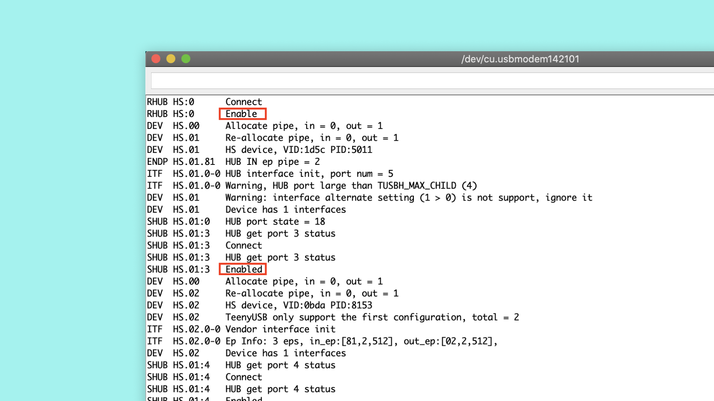

# Portenta H7 as a USB Host

It is possible to configure Portenta H7 to act as a USB host in a way that we can connect peripherals such as a keyboard or mouse to interact with the board. This way you could connect a keyboard to your Portenta and type numbers or characters to interact with the board.

## What you will learn

-   How to configure the Portenta H7 as a USB host
-   What type of peripherals can we connect and how
-   To write a small program that reads button presses from a keyboard

## Required hardware and software

-   Portenta H7 board (<https://store.arduino.cc/portenta-h7>)
-   USB-C cable (either USB-A to USB-C or USB-C to USB-C)
-   USB-C adapter (you can find [here](https://www.dustin.se/product/5011166993/travel-port-usb-c-total) the one we used for the tutorial)
-   External keyboard
-   Arduino IDE 1.8.10+  or Arduino Pro IDE 0.0.4+ 
-   Power supplier for the USB adapter (I don't know how to call this)

### Extra materials

-   Arduino Arduino MKR WiFi 1010 (or other board with at least two serial ports, check [here](https://www.arduino.cc/reference/en/language/functions/communication/serial/) the list of Arduino boards with more than one serial port.)Arduino IDE 1.8.10+  or Arduino Pro IDE 0.0.4+ 
-   USB cable compatible with the Arduino Arduino MKR WiFi 1010 (or the board you have selected)
-   3 Jumper wires


# Portenta and The ...

Lorem ipsum dolor sit amet, consectetuer adipiscing elit. Aenean commodo ligula eget dolor. Aenean massa. Lorem ipsum dolor sit amet, consectetuer adipiscing elit. Aenean commodo ligula eget dolor. Aenean massa. [Here](https://www.ni.com/en-us/innovations/white-papers/07/what-is-a-real-time-operating-system--rtos--.html) you can read more about real time operating systems.


# Setting Up the USB host

In this tutorial you are going to convert your Portenta in a USB Host that will allow you, by using a keyboard, to toggle the RGB built-in LEDs of the board. Throughout the tutorial, you will learn how to connected the keyboard to the Portenta board and how to program the board to become it in a USB Host device.

## 1. The Basic Setup

Begin by plugging in your Portenta board to the computer using a USB-C  cable and open the  Arduino IDE or the Arduino Pro IDE. If this is your  first time running Arduino sketch files on the board, we suggest you  check out how to [set up the Portenta H7 for Arduino](https://www.arduino.cc/pro/tutorials/portenta-h7/por-ard-gs) before you proceed. 


## 2. Creating the keyboard controller

Now, let's create a sketch that handles the USB connections and  modify the state of the LEDs with each press on the r(R), g(G) or b(B) keys, so when you press the key first time the LEDs will switch on and to turn them off, you will need to press the corresponding key again. 

As programming the USB protocol that allows the board handle USB devices is an arduous task, you will use an already built example called KeyboardController, to find it, first, make sure you select Arduino Portenta H7 (M7 core) as the board.


Then, open: File>Examples>USBHOST>KeyboardController


The **USBHost.h** library that is used in this example is a revamp of the classic Arduino **USBHost.h** library. This new version, among adapting the protocol to the USB newer versions, allows to connect devices through HUBs () USB adapters). For a better understanding about how the USBHost library works, it could be helpful for you to take a look at the Arduino [USBHost.h](https://www.arduino.cc/en/Reference/USBHost) library.

## 3. Detecting the keys from the keyboard

The example you have opened describes how the board will handle the connection with a keyboard, addressing the functionality of each one of the keys of it. In order to detect which one of the keys from the keyboard is pressed, you will need to modify and add some lines of code to the example.

Let's start by removing the comment line ( `//` ) of the following line `.on_key = process_key` at the beginning of the code. By doing this, each time you press a key, the program calls the function that converts the data received from the keyboard from `HEX` to `char`.

```cpp
static const tusbh_boot_key_class_t cls_boot_key = {
  .backend = &tusbh_boot_keyboard_backend,
  //.on_key = process_key
};
```

Then, in order to modify the state of the LEDs of the board with the r(R), g(G) or b(B) keys, you need to add the following portion of code inside the `process_key()` function, as shown in the image below:
```cpp
   if (ch == 'r' || ch == 'R')
    {
      ledRstate = !ledRstate;
      if (ledRstate == 1)
        digitalWrite(LEDR, LOW);
      else
        digitalWrite(LEDR, HIGH);
    }

    if (ch == 'g' || ch == 'G')
    {
      ledGstate = !ledGstate;
      if (ledGstate == 1)
        digitalWrite(LEDG, LOW);
      else
        digitalWrite(LEDG, HIGH);
    }

    if (ch == 'b' || ch == 'B')
    {
      ledBstate = !ledBstate;
      if (ledBstate == 1)
        digitalWrite(LEDB, LOW);
      else
        digitalWrite(LEDB, HIGH);
    }
```


## 4. Initializing the LEDs

Once you have the code that is going to detect if the correct keys are pressed and control the LEDs in function on them, you need ot initialise the LEDs, to do so, let's add the following portion of code inside the `setup()` function. 
```cpp
pinMode(LEDR, OUTPUT);
pinMode(LEDG, OUTPUT);
pinMode(LEDB, OUTPUT);

//Turn off the LEDs
digitalWrite(LEDR, HIGH);
digitalWrite(LEDG, HIGH);
digitalWrite(LEDB, HIGH);
```

And then, to finish with the code edition, you need to initialize ledRstate, ledGstate and ledBstate variables as boolean, by adding this portion of code before the `setup()` function. 

```cpp
bool ledRstate = 0;
bool ledGstate = 0;
bool ledBstate = 0;
```

## 5. Upload the Code

Before uploading the sketch to the board, save it you sketchbook and name it **leds_keyController.ino**. Then select the **Arduino Portenta H7 (M7 core)** from the **Board** menu and the port the Portenta is connected to. Upload the **leds_keyController.ino** sketch. Doing so will automatically compile the sketch beforehand.


## 6. Conecting a keyboard to Portenta

When you connect the Portenta board to the computer to program it, the computer is the USB host and the Portenta board is the USB slave, same happens when you connect a external keyboard to your PC. In this case, the Portenta board will be the host, it won't be connected to the PC, let's see how to make the connections.


In the image above you can see that:

+ The Portenta is connected to the "TO HOST" port from the HUB (USB C adapter)
+ The HUB (USB C adapter) needs to be powered externaly with a power supplier, it is needed to provide power to Portenta
+ You should connect the keyboard to the HUB (USB C adapter) in the same way you would connect it to your PC

## 7. Toggeling the LEDs

Once you have connected your portenta board, you should be able to toggle the LEDs by pressing the R, G or B keys.

 

If it doesn't work as it should try:

1. Reset the portenta by pressing the Reset button. 
2. Disconnect the Portenta board from the HUB (USB C adapter), disconnect the power from the HUB, connect the Portenta to the HUB and connect the power to the HUB.

# Conclusion

This tutorial shows how to connect and control a keyboard by configuring Portenta as an USB Host. On it, you also learnt how to modify one of the already build examples for Portenta to have a visual reference of the interactions between the keyboard and Portenta.

# Next Steps

Now that you've learnt how to set up the board as a USB Host and understood how the example works, start experimenting with the **KeyboardController.ino** sketch. This sketch can be tweaked in a variety of ways based on your needs. For example, you can add a mouse to the HUB and increase the bright of one of the LEDs of the board when pressing the left button and increase the bright of it when pressing the right button of the mouse.

# Troubleshooting

## LEDs not toggeling troubleshooting

This troubleshooting will guide you to find why the LEDs of your Portenta don't toggle when you press the keys on the keyboard, to do so, you will need some extra components such as:

* Arduino Arduino MKR WiFi 1010 board (or other Arduino board with at least two serial ports)
* USB cable to connect the extra board to the PC
* 3 jumper wires

To detect what the problem is about, we are going to send all the information about the USB peripheral (in this case the keyboard) through serial communication from Portenta to the Arduino MKR WiFi 1010 board. Once this info arrives to the Arduino MKR WiFi 1010 board, we will print it out through the Serial Monitor, which will allow us to debug what can be happening.

### 1. Connect the  Portenta to the Arduino MKR WiFi 1010

To connect thePortenta to the Arduino MKR WiFi 1010 board you will need connect the pins with Serial1 functionality (13RX and 14TX in both boards) between them as shown in the image below. Don't forget to connect as well the GNDs of the boards.


### 2. Program the Arduino MKR WiFi 1010 board

To set up Arduino MKR WiFi 1010 board copy the following code, paste it into a new sketch file and name it **mkr1010_serial.ino**. Then upload it to the Arduino Arduino MKR WiFi 1010 board. Make sure you select **Arduino MKR WiFi 1010** as the board and the port to which the Arduino MKR WiFi 1010 is connected.

```cpp
char data;

void setup()
{
  Serial.begin(9600);
  Serial1.begin(115200);
}

void loop()
{

  if (Serial1.available())
  {
    data = Serial1.read();
    Serial.write(data);
  }
}
```

### 3. System schema connection

After connecting the Portenta board to the Arduino MKR WiFi 1010 and programmed your Arduino MKR WiFi 1010 board, the schema connection you have should be similar to the followint one:


### 3. Open the Serial Monitor of the Arduino MKR WiFi 1010 board

Once you have everythig connected, open the Serial Monitor and reset the Portenta. Afeter reseting the Portenta board, you should get in your Serial Monitor something similar to the following image:

 

In the info received on the MKR WiFi 1010 board you should see some "Enabled" messages. It means that the Portenta recognise the different ports of your HUB. If you can see them, when you press any key of the keyboard, it should be printed on the Serial Monitor.

If in the info received on the MKR WiFi 1010 board you see any "Disabled" message, it means that something went wrong in the comunication of HUB and the Portenta board, if this happen, try: 

1. Reset the portenta by pressing the Reset button. 
2. Disconnect the Portenta board from the HUB (USB C adapter), disconnect the power from the HUB, connect the Portenta to the HUB and connect the power to the HUB.

If after repeating several times this process your system still no working, it may happen that the HUB you are using is not compatible with the Portenta board and you will need a different HUB to test this tutoral.


**Authors:** Jose Garcia   
**Reviewed by:**   
**Last revision:**
