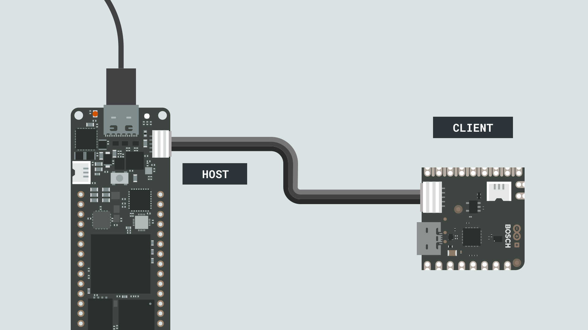
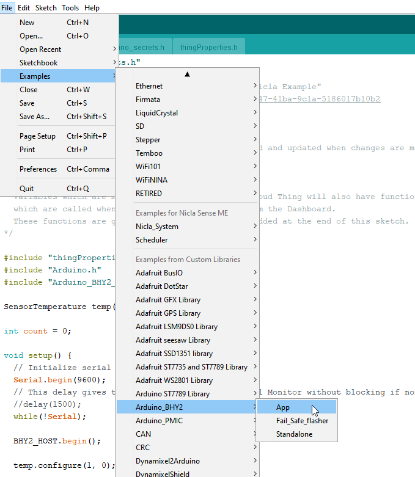
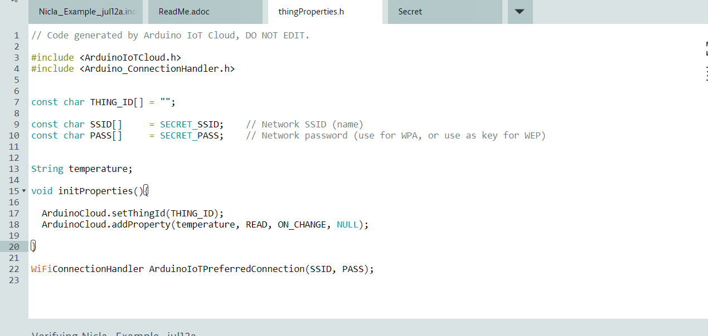

# Uploading Nicla Sense sensor data to IoT Cloud (DRAFT).

## Overview

In this tutorial we will learn how to upload data from the Nicla module to the IoT Cloud. We will use the Portenta H7 to interface with the Nicla Sense using the eslov connector and we will upload the data using the Portenta Wireless capabilities.

### You Will Learn

- How to configure the Portenta H7 to read temperature values from the Nicla Sense using the ESLOV connector.
- How to Attach the Portenta H7 to the IoT cloud
- Publish the temperature values that we obtained fron the Nicla board to the Arduino IoT Cloud.

### Required Hardware and Software

- Portenta H7 board
- Nicla sense board
- Eslov cable
- USB connection
- Wifi connectivity
- Arduino Create account

## Instructions

### 1. Hardware connection

For the hardware setup just connect the Nicla board to the Portenta H7 using the Eslov cable like in the illustration below. Then connect the Portenta H7 to your computer using the USB C cable.



### 2. Setup Eslov communication in the NICLA board

There are three ways to read from the on-board sensors:

1. Read the sensors directly from Nicla Sense ME in standalone mode.
2. Read sensor values through BLE
3. Read sensor values through UART by connecting an ESLOV cable.

To read from the sensors in any of these modes, you need to install the **Arduino_BHY2** and **Arduino_BHY2_HOST** libraries. Download the package from [here.](https://docs.arduino.cc/ca179f48cffbddcae9863d07cb19054b/nicla-sense-me-libs.zip). Inside the package you will find two zip files that you can install as libraries. To do so in the IDE select **Sketch->Include Library->Add .ZIP LIbrary**.

To have the Nicla Sense ME pass the sensor data through ESLOV you need to upload the **App** sketch. You can find it in the Examples menu in the IDE under **Arduino_BH2 -> App** (if you dont have the Nicla board selected, the library might be inside the *INCOMPATIBLE* section at the end of *Examples*). After you upload the sketch you can disconnect the Nicla Sense ME from the USB cable. It can be powered through the ESLOV connection.



For further tips on how to operate the Nicla module check the [cheat sheet.](https://docs.arduino.cc/tutorials/nicla-sense-me/cheat-sheet#sensor-data-over-eslov)

### 2. Set up the IoT cloud

To configure the IoT cloud you can follow this [tutorial.](https://docs.arduino.cc/cloud/iot-cloud/tutorials/iot-cloud-getting-started) When you are creating the variable to be published in the cloud, choose a String variable to store the temperature readings. In this tutorial we will use the [create](https://create.arduino.cc/) editor to upload the code to the Portenta. Once you are done with the configuration you should see a tab with the header file *thingProperties.h* where you can see the variable that will be updated to the cloud together with the rest of the IoT cloud setting functions.



### 4. Write the sketch to the portenta H7

Now it's time to write the code in the portenta to read from the Nicla and publish to the cloud.

First we include the headers that we need:

```cpp
#include "thingProperties.h"
#include "Arduino.h"
#include "Arduino_BHY2_HOST.h"
```

Then we assign the register ID for the temperature values in the Nicla module

```cpp
SensorTemperature temp(SENSOR_ID_TEMP);
```

Configure the serial port

```cpp
void setup() {
  // Initialize serial and wait for port to open:
  Serial.begin(9600);
  while(!Serial);
  Serial.println("Hello NICLA");
  ```

Configure the temperature sensor in the Nicla Board. 

```cpp
  //NICLA CONFIG
  Serial.print("Configuring temp sensor...");
  BHY2_HOST.begin();
  temp.configure(1, 0);
  Serial.println("Done");
  ```

Configure the IoT cloud 

```cpp
  // Defined in thingProperties.h
  Serial.print("Configuring IoT cloud...");
  initProperties();
  Serial.println("Done");
  
  // Connect to Arduino IoT Cloud
  Serial.print("Connecting to IoT cloud...");
  ArduinoCloud.begin(ArduinoIoTPreferredConnection);
  Serial.println("Done");
  
  /*
     The following function allows you to obtain more information
     related to the state of network and IoT Cloud connection and errors
     the higher number the more granular information you’ll get.
     The default is 0 (only errors).
     Maximum is 4
 */
  //setDebugMessageLevel(4);
  //ArduinoCloud.printDebugInfo();
  ```

Initializing the temperature value will let us know if the value has been updated to the cloud even if the sensor reading has not been performed. This is optional but is good for debugging.

```cpp
  temperature = "XX"; 
}
```

Now we write the loop function. Here we read a new temeprature value from the Nicla board every second.  

```cpp
void loop() 
{
//With this function we update the value in the IpT cloud
  ArduinoCloud.update();  
  static auto printTime = millis();

  BHY2_HOST.update();

Every second we update the value of the temperature variable
  if (millis() - printTime >= 1000)
 {
    printTime = millis();
    temperature = temp.toString();
    Serial.println(temperature);
    //Serial.println(temp.toString());
  }  
}
```

You can find the full sketch here:

```cpp
/* 
  Sketch generated by the Arduino IoT Cloud Thing "Nicla Example"
  https://create.arduino.cc/cloud/things/7c2c7ac5-1a47-41ba-9c1a-5186017b10b2 

  Arduino IoT Cloud Variables description

  The following variables are automatically generated and updated when changes are made to the Thing

  String temperature;

  Variables which are marked as READ/WRITE in the Cloud Thing will also have functions
  which are called when their values are changed from the Dashboard.
  These functions are generated with the Thing and added at the end of this sketch.
*/

#include "thingProperties.h"
#include "Arduino.h"
#include "Arduino_BHY2_HOST.h"

//SensorTemperature temp(SENSOR_ID_TEMP);
Sensor tempSensor(SENSOR_ID_TEMP);

void setup() {
  // Initialize serial and wait for port to open:
  Serial.begin(9600);
  while(!Serial);
  Serial.println("Hello NICLA");

  //NICLA CONFIG
  Serial.print("Configuring temp sensor...");
  BHY2_HOST.begin();
  tempSensor.configure(1, 0);
  Serial.println("Done");  

  // Defined in thingProperties.h
  Serial.print("Configuring IoT cloud...");
  initProperties();
  Serial.println("Done");
  
  // Connect to Arduino IoT Cloud
  Serial.print("Connecting to IoT cloud...");
  ArduinoCloud.begin(ArduinoIoTPreferredConnection);
  Serial.println("Done");
  
  //Assign an initial value.
  temperature = "XX";
  
  /*
     The following function allows you to obtain more information
     related to the state of network and IoT Cloud connection and errors
     the higher number the more granular information you’ll get.
     The default is 0 (only errors).
     Maximum is 4
 */
  //setDebugMessageLevel(4);
  //ArduinoCloud.printDebugInfo();
}

void loop() {
  ArduinoCloud.update();
  
  static auto printTime = millis();
  BHY2_HOST.update();

  if (millis() - printTime >= 1000) {
    printTime = millis();
    temperature = tempSensor.toString();
    Serial.println(temperature);
  }
}

```

## Conclusion

In this tutorial you learned how to upload the temperature values from the Nicla sense to the IoT cloud. You followed the process to set up the Nicla board to send data via the Eslov connection, and you configured the IoT cloud to receive the temperature data.

### Next Steps

- Try to upload other sensor data from he Nicla sense. You can see the available sensors int the [cheat sheet.](https://docs.arduino.cc/tutorials/nicla-sense-me/cheat-sheet#sensor-data-over-eslov)
- Experiment with the dashboard to add more data for a more sophisticated project.

## Troubleshooting

### Sketch Upload Troubleshooting

Lorem ipsum dolor sit amet, consectetuer adipiscing elit. Aenean commodo ligula eget dolor. Aenean massa. Lorem ipsum dolor sit amet, consectetuer adipiscing elit. Aenean commodo ligula eget dolor. Aenean massa. Lorem ipsum dolor sit amet, consectetuer adipiscing elit. Aenean commodo ligula eget dolor. Aenean massa.

**Authors:** 
**Reviewed by:** ZZ [18.03.2020]  
**Last revision:** AA [27.3.2020]
