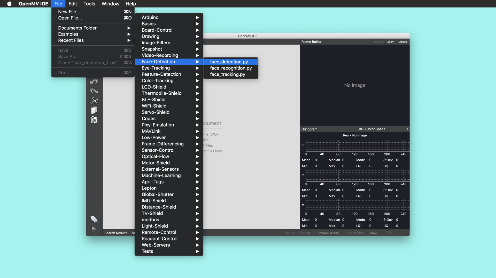

# Face Detection with Portenta and OpenMV
In this tutorial you will build a MicroPython application with OpenMV that uses the Portenta Vision Shield to detect faces and overlay them with a custom image, in this case, a smiley. Think of it as building your own camera filter that puts a smile on every face it detects.

## What You Will Learn
- How to use the OpenMV IDE to run MicroPython on Portenta,
- About the face detection method implemented in the example, 
- How to use the built-in face detection algorithm of OpenMV,
- How to use MicroPython to read files from the internal flash.

## Required Hardware and Software
- Portenta H7 board (<https://store.arduino.cc/portenta-h7>)
- Arduino Portenta Vision Shield (https://store.arduino.cc/portenta-vision-shield)
- USB C cable (either USB A to USB C or USB C to USB C)
- Arduino IDE 1.8.10+  or Arduino Pro IDE 0.0.4+ 
- Portenta Bootloader Version 20+
- OpenMV IDE 2.6.4+

# Face Detection through HAAR Cascade. 

Face detection happens by using a machine learning based approach called HAAR cascade. This approach uses a cascade algorithm that has multiple stages where the output from one stage acts as additional information for the next stage in the cascade. The different stages are responsible for detecting edges, lines, contrast checks and calculating pixel values in a given image. Larger areas of the image are checked first in the earlier stages followed by more numerous and smaller area checks in later stages. The HAAR Cascade function provided by OpenMV contains 25 such stages. HAAR Cascades are trained against hundreds of images with a face that are labelled as faces and an equivalent amount of images that dont have faces in them labeled differently. 


## 1. The Basic Setup

For this tutorial you will be using the OpenMV IDE along with the OpenMV firmare on your Portenta H7 to build the face detection sketch. If this is your first time using the Vision Carrier and OpenMV, We recommend you to take a look at the "Configuring the Development Environment" section inside the [Blob Detection tutorial](https://www.arduino.cc/pro/tutorials/portenta-h7/por-openmv-bt) to configure the development environment. 

## 2. The face_detection.py Sketch

Attach your Vision Carrier to your Portenta H7 and open the **openMV** Editor.  For this tutorial, you will be using **face_detection.py** example provided by OpenMV as a starting point. This example can be found inside **File->Examples->Face-Detection->face_detection.py**. 



You will also have to download a bitmap file (.pbm format) of your favourite emoji and Store it on the microSD card. Insert the microSD card into the Vision Carrier's SD card slot and connect the board to your computer. 

## 2. Preparing the Script

The Script starts by importing the `pyb`, `sensor`, `image` and  `time` modules for handling the board functions, camera sensor settings, machine vision algorithms and time tracking methods. 

```py
import sensor # Import the module for sensor related functions
import image # Import module containing machine vision algorithms
import time # Import module for tracking elapsed time
```

## 3. Preparing the Sensor

The next step is to calibrate the camera sensor for achieving the best results using the `sensor` module. The `set_contrast()`function sets the contrast of the sensor to its highest value 3 to easily identify lines and edges. `set_gainceiling()` a controls the amplification of the signal from the camera sensor including any associated background noise. For maximisng the detection rate for a gray scale camera, it is recommended to reduce the frame size to `HQVGA`.

## 3. Loading the Hair Cascade 

OpenMV provides a packaged Haar Cascade class formatted for the Vision Shield's Camera. The [`image.HaarCascade(path, number of stages)`](https://docs.openmv.io/library/omv.image.html#class-haarcascade-feature-descriptor) is used to load the built in HaarCascade binary file into the memory using the [`image`](https://docs.openmv.io/library/omv.image.html#) module. The `path` helps to specify the type of Haar Cascade file thats required which in this case is of the type `frontalface`. The `number of stages`is use to specify the Haar Cascade Stages required. 

```python
face_cascade = image.HaarCascade("frontalface", stages=25)
print(face_cascade)
```

## 4. Finding the Face Features

https://openmv-doc.readthedocs.io/library/omv.image.html#image.image.find_features

## 5. Displaying a Bitmap Image

Once you know the location of the faces in the camera image you can overlay them with an image of your choice. OpenMV currently supports bmp, pgm or ppm image formats. Image formats with an alpha layer such as PNG are not supported yet.

In this tutorial you will use a preloaded image in the monochrome [Portable Bitmap Image](https://en.wikipedia.org/wiki/Netpbm) (.pbm) format. This format consists of a matrix of zeroes and ones denoting black and white pixels. 1 stands for a black pixel, 0 for a white one. 

Connect your Portenta board to your computer if you haven't done so. Make sure you are running the OpenMV firmware on the Portenta. If you haven't installed the OpenMV firmware yet take a look at the "Configuring the Development Environment" section which explains how to proceed in that case. 

Download [this file](/assets/face.pbm) containing the smiley bitmap and copy it to the flash drive that was mounted when you connected the Portenta. Load the image into a variable called `faceImage` using the `Image()` function from the `image` module. The inital slash refers to the root directoy of the flash drive.

```py
faceImage = image.Image("/face.pbm", copy_to_fb=False)
```

Before you can draw the image on top of the camera stream you need to figure out the scale ratio to match the face size in the camera stream. The bitmap comes in a 128x128 px resolution. You can calculate the correct scale ratio with the following formula:

```py
faceX = boundingBox[0]
faceY = boundingBox[1]
faceWidth = boundingBox[2]

# Calculates the scale ratio to scale the bitmap image to match the bounding box
scale_ratio = faceWidth / faceImage.width()        
```

You can then draw the scaled bitmap image on top of the camera image using the `draw_image` function:

```py
# Draws the bitmap on top of the camera stream
cameraImage.draw_image(faceImage, faceX, faceY, x_scale=scale_ratio, y_scale=scale_ratio)
```

## 6. Uploading the Script

Let's program the Portenta with the complete script and test if the algorithm works. Copy the following script and paste it into the new script file that you created.

```py
import sensor # Import the module for sensor related functions
import image # Import module containing machine vision algorithms
import time # Import module for tracking elapsed time

sensor.reset() # Resets the sensor

sensor.set_contrast(3) # Sets the contrast to the highest level (min -3, max 3)
sensor.set_gainceiling(16)

# HQVGA and GRAYSCALE are the best for face tracking.
sensor.set_framesize(sensor.HQVGA)
sensor.set_pixformat(sensor.GRAYSCALE)

# Load the built-in frontal face Haar Cascade
# By default this will use all stages, lower stages is faster but less accurate.
face_cascade = image.HaarCascade("frontalface", stages=25)
print(face_cascade) # Prints the Haar Cascade configuration

faceImage = image.Image("/face.pbm", copy_to_fb=False) # Loads a bitmap file from the flash storage
clock = time.clock() # Instantiates a clock object to calculate the FPS

while (True):
    clock.tick() # Advances the clock
    cameraImage = sensor.snapshot() # Takes a snapshot and saves it in memory

    # Find objects.
    # Note: Lower scale factor scales-down the image more and detects smaller objects.
    # Higher threshold results in a higher detection rate, with more false positives.
    boundingBoxes = cameraImage.find_features(face_cascade, threshold=1, scale_factor=1.5)

    # Draw objects
    for boundingBox in boundingBoxes:
        faceX = boundingBox[0]
        faceY = boundingBox[1]
        faceWidth = boundingBox[2]

        # Calculates the scale ratio to scale the bitmap image to match the bounding box
        scale_ratio = faceWidth / faceImage.width()
        # Draws the bitmap on top of the camera stream
        cameraImage.draw_image(faceImage, faceX, faceY, x_scale=scale_ratio, y_scale=scale_ratio)


    # Print FPS.
    # Note: The actual FPS is higher when not displaying a frame buffer preview in the IDE
    print(clock.fps())
```

Click on the "Play" button at the bottom of the left toolbar. Point the camera on the Vision Shield towards your face check if the Portenta can detect it. Once it dects your face it should be covered by a smiley. If it can't detect your face try moving the camera further away or position yourself in front of a wall or another plain background.

# Conclusion

In this tutorial you learned how to use OpenMV's built-in face detection algorithm which is based on Haar Cascade. Furthermore you learned how to copy a file to the internal flash and how to load an image from the flash into the memory. You have also learned how to draw an image on top of a snapshot from the camera stream.

# Next Steps
- TBD

  -> LENARD

# Troubleshooting


**Authors:** Sebastian Romero, Lenard George  
**Reviewed by:** Lenard George [6.10.2020]  
**Last revision:** Sebastian Romero [7.10.2020]