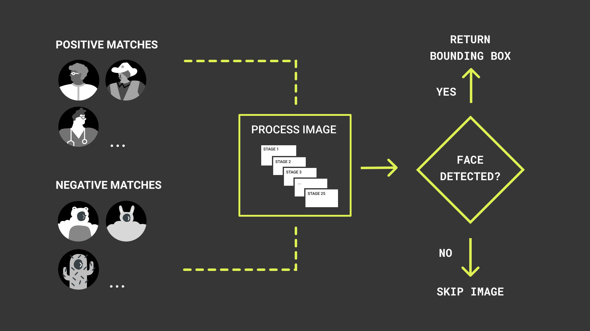

# Face Detection with Portenta and OpenMV
In this tutorial you will build a micropython application through openMV that uses the Portenta Vision Shield to    detect faces. 

## What You Will Learn
- How to use the OpenMV IDE to run MicroPython on Portenta,
- About the face detection method implemented in the example, 
- How to use the built-in face detection algorithm of OpenMV,
- How to use MicroPython to read files from the internal flash.

## Required Hardware and Software
- Portenta H7 board (<https://store.arduino.cc/portenta-h7>)
- Arduino Portenta Vision Shield (https://store.arduino.cc/portenta-vision-shield)
- USB C cable (either USB A to USB C or USB C to USB C)
- Arduino IDE 1.8.10+  or Arduino Pro IDE 0.0.4+ 
- Portenta Bootloader Version 20+
- OpenMV IDE 2.6.4+

# Face Detection through HAAR Cascade. 

Face detection happens by using a machine learning based approach called HAAR cascade. This approach uses a cascade algorithm that has multiple stages where the output from one stage acts as additional information for the next stage in the cascade. The different stages are responsible for detecting edges, lines, contrast checks and calculating pixel values in a given image. Larger areas of the image are checked first in the earlier stages followed by more numerous and smaller area checks in later stages. The HAAR Cascade function provided by OpenMV contains 25 such. HAAR Cascades are trained against hundreds of images with a face that are labelled as faces and an equivalent amount of images that dont have faces in them labeled differently. 



# Configuring the Development Environment

If you haven't installed the OpenMV IDE yet, please have a look at the tutorial XYZ...

## 1. Prepare the Script

Create a new script by clicking the "New File" button in the toolbar on the left side. Import the required modules:

```py
import pyb # Import module for board related functions
import sensor # Import the module for sensor related functions
import image # Import module containing machine vision algorithms
import time # Import module for tracking elapsed time
```

## 2. Preparing the Sensor


## 3. Loading the Hair Cascade 

OpenMV provides a packaged Haar Cascade class formatted for the Vision Shield's Camera. The [`image.HaarCascade(path, number of stages)`](https://docs.openmv.io/library/omv.image.html#class-haarcascade-feature-descriptor) is used to load the built in HaarCascade binary file into the memory using the [`image`](https://docs.openmv.io/library/omv.image.html#) module. The `path` helps to specify the type of Haar Cascade file thats required which in this case is of the type `frontalface`. The `number of stages`is use to specify the Haar Cascade Stages required. 

```python
face_cascade = image.HaarCascade("frontalface", stages=25)
print(face_cascade)
```

## 4. Reading a bitmap image

To overlay an image once a face is detected we need to have preloaded image in a [Portable Bitmap Image](https://en.wikipedia.org/wiki/Netpbm) (.pbm) format. The reason behind using the .pbm format is because t These files are text-based, black and white image files that contain either a 1 for a black pixel or a 0 for a white pixe be in text files.  Load your image into `faceImage` using the image.Image() method 

In order to...

## 4. Overlaying an Image
## 5. Finding the face features

https://openmv-doc.readthedocs.io/library/omv.image.html#image.image.find_features

## 5. Uploading the Script
Let's program the Portenta with the complete script and test if the algorithm works. Copy the following script and paste it into the new script file that you created.

```py
import pyb # Import module for board related functions


```

# Conclusion

In this tutorial you learned...

# Next Steps
-   TBD

# Troubleshooting


**Authors:** Sebastian Romero, Lenard George  
**Reviewed by:** Lenard George [6.10.2020]  
**Last revision:** Sebastian Romero [7.10.2020]