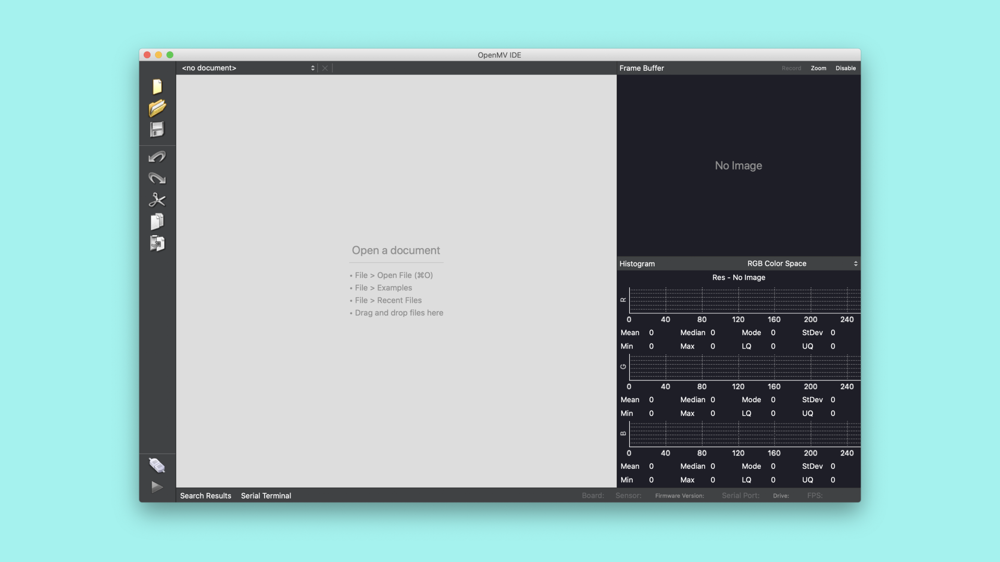
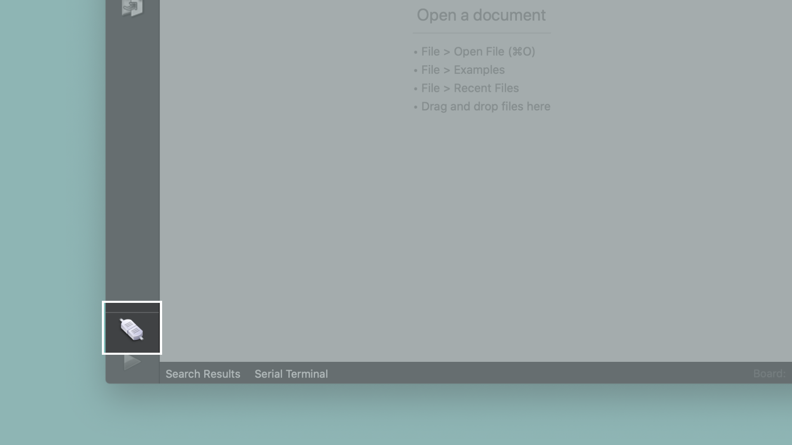
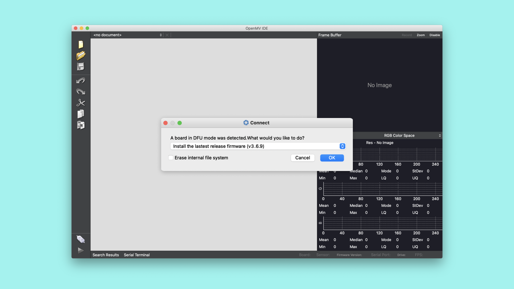
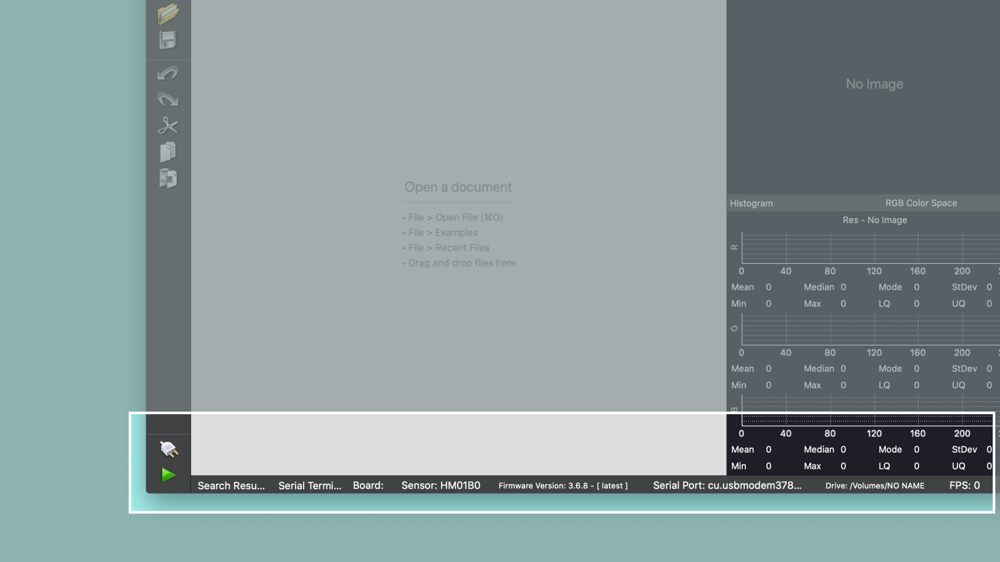

# Getting started with OpenMV

## Overview
In this tutorial, you will learn about how the vision carrier board for Portenta works with OpenMV and MicroPython. This tutorial will go through some features in OpenMV that are good to know about when using this hardware and software. You will then write a simple script in MicroPython that will make use of these OpenMV features with your Portenta board.

### What You Will Learn
- How to use the OpenMV IDE
- How to use the OpenMV IDE to run MicroPython on Portenta

### Required Hardware and Software
- Portenta H7 board (<https://store.arduino.cc/portenta-h7>)
- Arduino Portenta Vision Shield (https://store.arduino.cc/portenta-vision-shield)
- USB C cable (either USB A to USB C or USB C to USB C)
- Arduino IDE 1.8.10+  or Arduino Pro IDE 0.0.4+ 
- Portenta Bootloader Version 20+
- OpenMV IDE 2.6.4+

## Portenta and the OpenMV IDE
The OpenMV IDE was built for Machine Vision applications. It is meant to provide an Arduino like experience for simple computer vision tasks using a camera sensor. OpenMV comes with its own firmware that is built on MicroPython. Among other hardware it supports the Portenta board. A statement from the creators of OpenMV on why they built it:

>Currently, doing anything serious involving computer vision requires a computer running an operating system running many layers of software and requiring much set up before you can get computer vision code working. This is all well and fine if you need to do many other things than just processing images, like connecting to the internet, running many different applications concurrently, etc.

>But, what if, I just want to make an LED turn on if a red object appears in front of a white wall. Why do a need to build up a complex system for that? Or, what if I just want to turn on an LED when a face is in view?

This is where OpenMV comes in. [Here](https://openmv.io/) you can read more about the OpenMV IDE.

## MicroPython

With OpenMV and the Portenta board, it is possible to use MicroPython in sketches. 

[Here](http://docs.MicroPython.org/en/latest/) you can read more about MicroPython.

## OpenMV features

### Histogram

The histogram is useful for getting feedback about the lighting quality in the room, determining color tracking settings, and in general just giving you an idea about the quality of the image your OpenMV Cam is looking at.

You can select between four different color spaces in the histogram. Either RGB, Grayscale, LAB, and YUV.

[Screenshot focused on the histogram in OpenMV]()

By default, the histogram shows information about the whole image. However, if you select an area of the frame buffer by clicking and dragging on it then the histogram will only show the distribution of colors in that area. This feature makes the histogram display useful for determining the correct Grayscale and LAB color channel settings you need to use.

Finally, the image resolution and ROI (x, y, w, h) of the bounding box you select on the image are displayed above the histogram graphs.

### Serial terminal

All debug text from your OpenMV Cam created by print will be displayed in the Serial Terminal.

[Screenshot focused on the Serial terminal area in OpenMV]()

### Frame buffer

The OpenMV IDE has an integrated frame buffer viewer. Making it easy for you to see what the OpenMV Cam is looking at while working on your code. 

The frame buffer viewer displays whatever was in your OpenMV Cam's frame buffer previously when `sensor.snapshot()` is calLED.

[Screenshot focused on the frame buffer area in OpenMV]()

The `Reocord` button in the frame buffer area of OpenMV IDE records whatever is in the frame buffer. It can be used to quickly make videos of what your OpenMV Cam sees. Recording works by recording whatever is in OpenMV IDE's frame buffer at 30 FPS. However, the frame buffer may be updating faster or slower than this depending on the application. 

The `Disable` button in the frame buffer area of OpenMV IDE controls whether or not your OpenMV Cam will send images to OpenMV IDE. Your OpenMV Cam has to JPEG compress images constantly to stream them to OpenMV IDE. This reduces performance. If you want to see how fast your script will run without your OpenMV Cam being connected to your computer just click the `Disable` button. While the frame buffer is disabLED you won't be able to see what your OpenMV Cam is looking at anymore.

You can right click on the image you see in the frame buffer viewer to save that image. If you select an area in the frame buffer by clicking and dragging you can save just that area instead. You should stop the script before trying to save the frame buffer. Otherwise, you may not get the exact frame you want.

> To de-select an area in the frame buffer, click anywhere without dragging to remove the selection.

## Instructions

### Configuring the Development Environment
Before you can start programming OpenMV scripts for the Portenta you need to download and install the OpenMV IDE.

***IMPORTANT: Before you connect the Portenta to the OpenMV IDE make sure you update the bootloader as explained in the "Flashing the OpenMV Firmware" section!***

### 1. Downloading the OpenMV IDE
Open the [OpenMV download](https://openmv.io/pages/download) page in your browser and download the version that you need for your operating system. Alternatively, you may use the following direct download links of the OpenMV IDE 2.6.5:

- [For Windows Xp, Vista, 7, 8, 10 or Later](https://github.com/openmv/openmv-ide/releases/download/v2.6.5/openmv-ide-windows-2.6.5.exe)
- [For OsX Snow Leopard 10.6 or Later](https://github.com/openmv/openmv-ide/releases/download/v2.6.5/openmv-ide-mac-2.6.5.dmg)
- [For Ubuntu 12.04 Lts 32-Bit or Later](https://github.com/openmv/openmv-ide/releases/download/v2.6.5/openmv-ide-linux-x86-2.6.5.run)
- [For Ubuntu 12.04 Lts 64-Bit or Later](https://github.com/openmv/openmv-ide/releases/download/v2.6.5/openmv-ide-linux-x86_64-2.6.5.run)
- [For Raspberry Pi 0, 1, 2, 3, and 4 or Later](https://github.com/openmv/openmv-ide/releases/download/v2.6.5/openmv-ide-linux-arm-2.6.5.tar.gz)

Follow the instructions of the installer.

### 2. Flashing the OpenMV Firmware

Connect the Portenta to your computer via the USB-C cable if you haven't done so yet. Make sure you first update the bootloader to the latest version using the *PortentaH7_updateBootloader* sketch in the examples menu in the Arduino IDE. 
Instructions on how to update the bootloader can be found in the ["Updating the Portenta Bootloader" tutorial](https://www.arduino.cc/pro/tutorials/portenta-h7/por-ard-bl).

***In bootloader versions 17 and older there was a bug that could put the Portenta in a boot loop when the transmission aborted while flashing a large firmware file. This was fixed in the bootloader version 18. We strongly advise to update the bootloader before you proceed with the next step of this tutorial!***

After updating the bootloader put the Portenta in bootloader mode by double pressing the reset button on the board. The built-in green LED will start fading in and out. Now open the OpenMV IDE.



Click on the "connect" symbol at the bottom of the left toolbar. 



A pop-up will ask you how you would like to proceed "DFU bootloader(s) found. What would you like to do?". Select "Reset Firmware to Release Version". This will install the latest OpenMV firmware on the Portenta. If it asks you whether it should erase the internal file system you can click "No".



Portenta's green LED will start flashing while the OpenMV firmware is being uploaded to the board. A terminal window will open which shows you the upload progress. Wait until the green LED stops flashing and fading. You will see a message saying "DFU firmware update complete!" when the process is done.

***Installing the OpenMV firmware will overwrite any existing sketches in the internal flash of Portenta. As a result the M7 port won't be exposed in the Arduino IDE anymore. To re-flash the M7 with an Arduino firmware you need to put the board into bootloader mode. To do so double press the reset button on the Portenta H7 board. The built-in green LED will start fading in and out. In bootloader mode you will see the Portenta M7 port again in the Arduino IDE.***

The Portenta will start flashing its blue LED when it's ready to be connected. After confirming the completion dialog the Portenta should already be connected to the OpenMV IDE, otherwise click the "connect" button once again.



### 3. Preparing the MicroPython Sketch

Create a new script by clicking the "New File" button in the toolbar on the left side. Import the required modules:

```py
import pyb # Import module for board related functions
import sensor # Import the module for sensor related functions
import image # Import module containing machine vision algorithms
```

A module in Python is a confined bundle of functionality. By importing it into the script it gets made available.

### 4. Preparing the Sensor

In order to use the camera, it has to be configured in the script.

```py
sensor.reset() # Resets and initialize the camera sensor.
sensor.set_pixformat(sensor.GRAYSCALE) # Sets the sensor to grayscale.
sensor.set_framesize(sensor.QVGA) # Sets the resolution to 320x240 px
sensor.skip_frames(time = 2000) # Let new settings take affect.
```

The camera that comes with the Portenta Vision Carrier only supports grayscale images, which is why we set `set_pixformat` parameter to `sensor.GRAYSCALE`.

When we set a resolution with the `set_framesize` function, it needs to be in a format that is supported by the sensor.

`sensor.skip_frames()` should be used to let the camera image stabilize after the camera's settings have been changed. If you intend to change the camera's settings this function should be calLED.

### 5. Using MicroPython

MicroPython allows us to control the Portenta board in OpenMV. With these functions, you can easily trigger visual feedback on the Portenta board. This is a useful tool to have when creating scripts and trying them out.

```py
LEDRed = pyb.LED(1) # Initiates the green LED
LEDGreen = pyb.LED(2) # Initiates the green LED
LEDBlue = pyb.LED(3) # Initiates the green LED
```

Calling on `pyb.LED()` we can change the state of the built-in LED on the Portenta board. Assigning them to a variable will make it easier to use later in the script. Determining color is as easy as entering a different argument into the function.

### 5. Uploading the Script

The script will first print a message in the serial terminal to confirm that it is on. The built-in LED will be glowing red, red will indicate the preparation time before a picture is taken. It will then switch to green when the photo is being taken. The blue light will indicate when the process is done and the picture is saved. The script uses delays to make it possible to see the changes in the state of the LED. Messages will also be printed in the terminal throughout the process, giving you an extra debugging tool.

```py
import pyb # Import module for board related functions
import sensor # Import the module for sensor related functions
import image # Import module containing machine vision algorithms

sensor.reset() # Initialize the camera sensor.
sensor.set_pixformat(sensor.GRAYSCALE) # or sensor.GRAYSCALE
sensor.set_framesize(sensor.QVGA) # or sensor.QQVGA (or others)
sensor.skip_frames(time = 1000) # Let new settings take affect.

ledRed = pyb.LED(1) # Initiates the green led
ledGreen = pyb.LED(2) # Initiates the green led
ledBlue = pyb.LED(3) # Initiates the green led

print("Camera turned on!") # Prints a message to the serial console
ledRed.on() # Turns the built in LED on and sets it to the color red
sensor.skip_frames(time = 3000) # Give some space between light on and photo taken. Time can be increased inside here to better fit your scenario.
ledRed.off()
ledGreen.on()
print("Say cheese!")
sensor.snapshot().save("test.jpg") # test.jpg will be the name of the 
pyb.delay(600) # Delay to be able to see the change in color on the LED
ledGreen.off()
ledBlue.on()
pyb.delay(600)
print("Done! Reset the camera to see the saved image.")
ledBlue.off()
```

The saved image is located on the Portenta drive that mounts after connecting the board.

## Conclusion

In this tutorial you learned how to use the OpenMV IDE to develop MicroPython scripts that then run on the Portenta board. You learned how to interact with the built-in LEDs in MicroPython on the OpenMV firmware. Lastly, you learned how to use the vision carrier board in OpenMV.


### Next Steps
-   Blob Detection with Portenta and OpenMV
-   Creating a Basic Face Filter With OpenMV

## Troubleshooting
### OpenMV Firmware Flashing Issues
- If the upload of the OpenMV firmware fails during the download, put the board back in boot loader mode and try again. Give it a few tries until the firmware gets successfully uploaded.
- If the upload of the OpenMV firmware fails without even starting, try uploading the latest firmware using the "Load Specific Firmware File" option. You can find the latest firmware on the [OpenMV Github repository](https://github.com/openmv/openmv/releases). Look for a file calLED *firmware.bin* in the PORTENTA folder.
- If you experience issues putting the board in bootloader mode, make sure you first update the bootloader to the latest version using the *PortentaH7_updateBootloader* sketch from the examples menu in the Arduino IDE.
- If the camera cannot get recognized by the OpenMV IDE or if you see a "No OpenMV Cams found!" message, press the reset button of Portenta once and wait until you see the blue LED flashing. Then try again connecting to the board.
- If you see a "OSError: Reset FaiLED" message, reset the board by pressing the reset button. Wait until you see the blue LED flashing, connect the board to the OpenMV IDE and try running the script again.

**Authors:** Sebastian Romero, Benjamin Dannegård
**Reviewed by:** ZZ [YYYY-MM-DD]  
**Last revision:** AA [YYYY-MM-DD]
