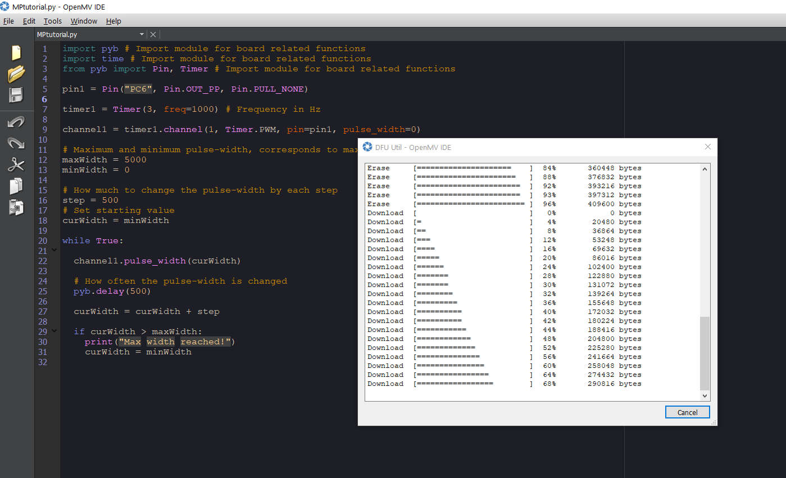
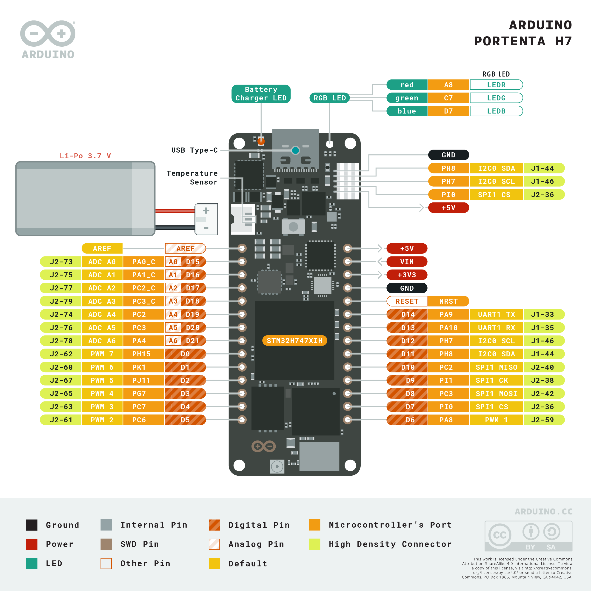
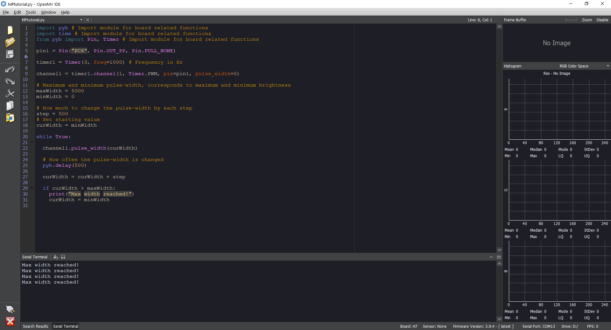

# Getting Started with OpenMV and MicroPython

## Overview
In this tutorial, you will learn about some of the basic features of the OpenMV IDE and run a MicroPython script that controls the PWM on the I/O pins of the Arduino Portenta H7. 

### You Will Learn
- The basic features of the OpenMV IDE
- How to use the OpenMV IDE to run MicroPython on Portenta
- Micropython commands to use the PWM and I/O pins on the Portenta

### Required Hardware and Software
- Portenta H7 board (<https://store.arduino.cc/portenta-h7>)
- Arduino Portenta Vision Shield (https://store.arduino.cc/portenta-vision-shield)
- USB C cable (either USB A to USB C or USB C to USB C)
- Arduino IDE 1.8.10+  or Arduino Pro IDE 0.0.4+ 
- Portenta Bootloader Version 20+
- OpenMV IDE 2.6.4+

## Portenta and the OpenMV IDE
The OpenMV IDE was built for Machine Vision applications. It is meant to provide an Arduino like experience for simple computer vision tasks using a camera sensor. OpenMV comes with its own firmware that is built on MicroPython. Among other hardware it supports the Portenta board.

This is where OpenMV comes in. [Here](https://openmv.io/) you can read more about the OpenMV IDE.

## MicroPython and PWM

With OpenMV and the Portenta board, it is possible to run MicroPython scripts. MicroPython includes a lot of classes and libraries that makes it easier for us to use the Portenta to its full potential.

[Here](http://docs.MicroPython.org/en/latest/) you can read more about MicroPython.

The features we will focus on in this tutorial is controlling pulse width modulation (PWM) with MicroPython. PWM is a way to get an artificial analog output on a digital pin. By rapidly toggling the pin from low to high. There are two parameters associated with this: the frequency of the toggling, and the duty cycle. The duty cycle is defined to be how long the pin is high compared with the length of a single period. Maximum duty cycle is when the pin is high all the time, and minimum is when it is low all the time.

PWM can be used to control the brightness in smart lighting systems, the speed of motors and it is usually used in audio and video amplifiers. In this tutorial you will see a similar method to how it is used to control brightness in lighting systems. Using PWM is an efficient way of providing electrical power when the state is somewhere between on and off. The same is true for controlling a motor with PWM, allowing for better speed stability. Making it possible for the motor to run at slower speeds without stalling.

>On the Portenta the pins PA8, PC6, PC7, PG7, PJ11, PK1, and PH15 support PWM.

## Instructions

### 1. Downloading the OpenMV IDE

Before you can start programming OpenMV scripts for the Portenta you need to download and install the OpenMV IDE.

***IMPORTANT: Before you connect the Portenta to the OpenMV IDE make sure you update the bootloader as explained in the "Flashing the OpenMV Firmware" section!***

Open the [OpenMV download](https://openmv.io/pages/download) page in your browser, download the version that you need for your operating system and follow the instructions of the installer.

### 2. Flashing the OpenMV Firmware

Connect the Portenta to your computer via the USB-C cable if you haven't done so yet. Make sure you first update the bootloader to the latest version using the **PortentaH7_updateBootloader** sketch in the examples menu in the Arduino IDE.

>Instructions on how to update the bootloader can be found in the ["Updating the Portenta Bootloader" tutorial](https://www.arduino.cc/pro/tutorials/portenta-h7/por-ard-bl).

After updating the bootloader put the Portenta in bootloader mode by double pressing the reset button on the board. The built-in green LED will start fading in and out. Now open the OpenMV IDE.


Click on the "connect" symbol at the bottom of the left toolbar. 


A pop-up will ask you how you would like to proceed "DFU bootloader(s) found. What would you like to do?". Select "Reset Firmware to Release Version". This will install the latest OpenMV firmware on the Portenta. If it asks you whether it should erase the internal file system you can click "No".


Portenta's green LED will start flashing while the OpenMV firmware is being uploaded to the board. A terminal window will open which shows you the upload progress. Wait until the green LED stops flashing and fading. You will see a message saying "DFU firmware update complete!" when the process is done.



>Installing the OpenMV firmware will overwrite any existing sketches in the internal flash of Portenta. As a result the M7 port won't be exposed in the Arduino IDE anymore. To re-flash the M7 with an Arduino firmware you need to put the board into bootloader mode. To do so double press the reset button on the Portenta H7 board. The built-in green LED will start fading in and out. In bootloader mode you will see the Portenta M7 port again in the Arduino IDE.

The Portenta will start flashing its blue LED when it's ready to be connected. After confirming the completion dialog the Portenta should already be connected to the OpenMV IDE, otherwise click the "connect" button once again.


### 3. Wiring the LED for the Script

To be able to change the LED's intensity with PWM we need to first connect the Portenta to the LED. If you want to use other pins than the ones shown here, take a look at the pinout diagram.



Here you can also see what functionality each pin has. In this tutorial wire the pin PC6 via a resistor to the positive leg of the LED, and wire the boards GND to the negative leg of the LED. As shown in the illustration.


### 4. Preparing the Pin and PWM with MicroPython

Create a new script by clicking the "New File" button in the toolbar on the left side. Import the required modules:

```py
import pyb # Import module for board related functions
import time # Import module for board related functions
from pyb import Pin, Timer # Import module for board related functions
```

A module in Python is a confined bundle of functionality. By importing it into the script it gets made available.

In order to control a LED connected to one of our pins, we first need to configure the pins behavior. After, we can set up the PWM.

In the `pin1` variable we define what pin on the board we intend to use. We also define if it should be an input or output pin with `Pin.OUT_PP`. Lastly, we can set the behaviour of the pull-up resistor on the pin, for now we set it as `Pin.PULL_NONE`.

For more info about the options available, please see [here](https://docs.micropython.org/en/latest/library/pyb.Pin.html)

```py
pin1 = Pin("PC6", Pin.OUT_PP, Pin.PULL_NONE)
```

With the `timer1` variable we will determine what id the timer will have and what frequency it will use. With a timer frequency of 1000 Hz, each cycle takes 1 millisecond. When setting up the PWM channel we can then use these variables. With the `timer1.channel()` function we can customize the PWM channels behavior. `pulse_width` sets the initial pulse width for the PWM.

```py
timer1 = Timer(3, freq=1000) # Frequency in Hz
channel1 = timer1.channel(1, Timer.PWM, pin=pin1, pulse_width=0)
```

We also enter parameters for how much the LED will change each time the PWM pulses with the `step` variable, what value it should start on with `minWidth` and 
when it will reset with the `maxWidth` variable.

```py
# maximum and minimum pulse-width, corresponds to maximum and minimum brightness
maxWidth = 5000
minWidth = 0

# How much to change the pulse-width by each step
step = 500
# Set starting value
currentWidth = minWidth
```

### 5. Creating the Main Loop in the Script

Putting our code inside a `while True:` function will make the code run in a loop.

We use the `channel1.pulse_width()` function to set the pulse width of the PWM channel, changing the intensity of the LED. Using `pyb.delay()` we can make the script stop running for the determined amount of time, which is 500 milliseconds in this example. At the end, we check if the value has reached our defined end, we print a message to the serial terminal and reset the `currentWidth` variable.

```py
while True:

  channel1.pulse_width(currentWidth)

  # this determines how often we change the pulse-width.
  pyb.delay(500)

  currentWidth = currentWidth + step

  if currentWidth > maxWidth:
    print("Max width reached!")
    currentWidth = minWidth
```

### 6. Uploading the Script

Heres the complete sketch for generating a PWM on the I/O pin 5. Connect your board to OpenMV and upload the following sketch.  

```py
import pyb # Import module for board related functions
import time # Import module for board related functions
from pyb import Pin, Timer # Import module for board related functions

pin1 = Pin("PC6", Pin.OUT_PP, Pin.PULL_NONE)

timer1 = Timer(3, freq=1000) # Frequency in Hz

channel1 = timer1.channel(1, Timer.PWM, pin=pin1, pulse_width=0)

# Maximum and minimum pulse-width, corresponds to maximum and minimum brightness
maxWidth = 5000
minWidth = 0

# How much to change the pulse-width by each step
step = 500
# Set starting value
currentWidth = minWidth

while True:
  channel1.pulse_width(currentWidth)

  # How often the pulse-width is changed
  pyb.delay(500)
  currentWidth = currentWidth + step

  if currentWidth > maxWidth:
    print("Max width reached!")
    currentWidth = minWidth
```

To upload the code to your board in OpenMV, press the green play button in the lower left corner.


If the wiring is correct the LED light should start incrementally getting brighter before resetting and starting over. Printing a message when the limit has been reached. If everything went correctly you should get the same output in the serial terminal as seen below.



## Conclusion

In this tutorial, you learned how to use the OpenMV IDE to develop MicroPython scripts that run on the Portenta board. You learned how to use and configure I/O pins and PWM on the Portenta. Lastly, you learned how to use these to control a LED light.

### Next Steps
-   Try using the Portenta and PWM to control a servo motor.
-   Experiment with MicroPythons capabilities with the Portenta M7. If you want some examples of what to do, take a look at the examples included in OpenMV. Go to: **File>Examples>Arduino>Portenta H7**.

## Troubleshooting
### OpenMV Firmware Flashing Issues
- If the upload of the OpenMV firmware fails during the download, put the board back in boot loader mode and try again. Give it a few tries until the firmware gets successfully uploaded.
- If the upload of the OpenMV firmware fails without even starting, try uploading the latest firmware using the "Load Specific Firmware File" option. You can find the latest firmware on the [OpenMV Github repository](https://github.com/openmv/openmv/releases). Look for a file calLED **firmware.bin** in the PORTENTA folder.
- If you experience issues putting the board in bootloader mode, make sure you first update the bootloader to the latest version using the **PortentaH7_updateBootloader** sketch from the examples menu in the Arduino IDE.
- If you see a "OSError: Reset FaiLED" message, reset the board by pressing the reset button. Wait until you see the blue LED flashing, connect the board to the OpenMV IDE and try running the script again.
- In bootloader versions 17 and older there was a bug that could put the Portenta in a boot loop when the transmission aborted while flashing a large firmware file. This was fixed in the bootloader version 18.

**Authors:** Sebastian Romero, Benjamin Dannegård  
**Reviewed by:** Lenard George [2021-04-12]  
**Last revision:** Benjamin Dannegård [2021-04-14]
