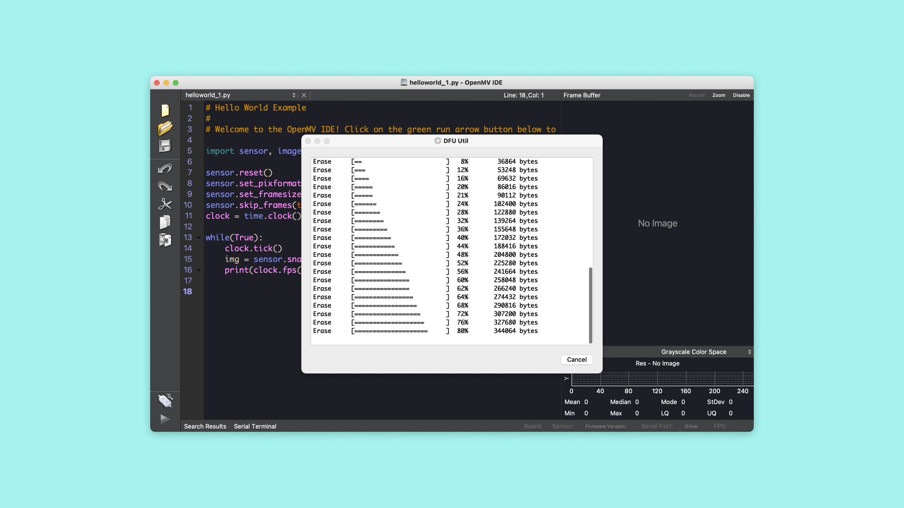

# Getting Started with OpenMV and MicroPython
## Overview
In this tutorial, you will learn about some of the basic features of the OpenMV IDE and how to create a simple MicroPython script. This tutorial will also walk you through connecting and uploading to your Portenta board with the OpenMV IDE. 

### You Will Learn
- The basic features of the OpenMV IDE
- How to create a simple MicroPython script
- How to use the OpenMV IDE to run MicroPython on Portenta


### Required Hardware and Software
- Portenta H7 board (<https://store.arduino.cc/portenta-h7>)
- USB C cable (either USB A to USB C or USB C to USB C)
- Portenta Bootloader Version 20+
- OpenMV IDE 2.6.4+

## Portenta and the OpenMV IDE
The OpenMV IDE was built for Machine Vision applications. It is meant to provide an Arduino like experience for simple computer vision tasks using a camera sensor. OpenMV comes with its own firmware that is built on MicroPython. Among other hardware it supports the Portenta board.

This is where OpenMV comes in. [Here](https://openmv.io/) you can read more about the OpenMV IDE.

## MicroPython
With OpenMV and the Portenta board, it is possible to run MicroPython scripts. MicroPython includes a lot of classes and libraries that makes it easier for us to use the Portenta to its full potential.

[Here](http://docs.MicroPython.org/en/latest/) you can read more about MicroPython.

## Instructions
### 1. Downloading the OpenMV IDE

Before you can start programming OpenMV scripts for the Portenta you need to download and install the OpenMV IDE.

***IMPORTANT: Before you connect the Portenta to the OpenMV IDE make sure you update the bootloader as explained in the "Flashing the OpenMV Firmware" section!***

Open the [OpenMV download](https://openmv.io/pages/download) page in your browser, download the version that you need for your operating system and follow the instructions of the installer.

### 2. Flashing the OpenMV Firmware

Connect the Portenta to your computer via the USB-C cable if you haven't done so yet. Make sure you first update the bootloader to the latest version using the **PortentaH7_updateBootloader** sketch in the examples menu in the Arduino IDE.

>Instructions on how to update the bootloader can be found in the ["Updating the Portenta Bootloader" tutorial](https://www.arduino.cc/pro/tutorials/portenta-h7/por-ard-bl).

After updating the bootloader put the Portenta in bootloader mode by double-pressing the reset button on the board. The built-in green LED will start fading in and out. Now open the OpenMV IDE.


Click on the "connect" symbol at the bottom of the left toolbar. 


A pop-up will ask you how you would like to proceed "DFU bootloader(s) found. What would you like to do?". Select "Reset Firmware to Release Version". This will install the latest OpenMV firmware on the Portenta. If it asks you whether it should erase the internal file system you can click "No".


Portenta's green LED will start flashing while the OpenMV firmware is being uploaded to the board. A terminal window will open which shows you the upload progress. Wait until the green LED stops flashing and fading. You will see a message saying "DFU firmware update complete!" when the process is done.



>Installing the OpenMV firmware will overwrite any existing sketches in the internal flash of Portenta. As a result the M7 port won't be exposed in the Arduino IDE anymore. To re-flash the M7 with an Arduino firmware you need to put the board into bootloader mode. To do so double press the reset button on the Portenta H7 board. The built-in green LED will start fading in and out. In bootloader mode you will see the Portenta M7 port again in the Arduino IDE.

The Portenta will start flashing its blue LED when it's ready to be connected. After confirming the completion dialog the Portenta should already be connected to the OpenMV IDE, otherwise click the "connect" button once again.


### 3. Preparing the Script

Create a new script by clicking the "New File" button in the toolbar on the left side. Import the required modules:

```py
import pyb # Import module for board related functions
```

A module in Python is a confined bundle of functionality. By importing it into the script it gets made available. For this example we only need `pyb`, which is a module that handles functionality for the board. You can read more about its functions [here](https://docs.micropython.org/en/latest/library/pyb.html).

Now we can create the variables that will control our built-in LED. The Portenta has multiple colored LEDs, with `pyb` we can easily control each one.

```py
redLED = pyb.LED(1) # built-in red LED
greenLED = pyb.LED(2) # built-in green LED
blueLED = pyb.LED(3) # built-in blue LED
```

Now we can easily distinguish between which color we control in the script.

### 4. Creating the Main Loop in the Script

Putting our code inside a `while True:` function will make the code run in a loop. In the loop we turn on a LED with `.on()`, then we use `pyb` to create a delay with `pyb.delay()`. This function will put a delay on the board's execution of the script, the duration of the delay can be controlled by changing the value inside the parentheses, the number defines how many milliseconds the board will wait. After the time entered has passed, we turn off the LED with `.off()`. Then we repeat for each color.

```py
while True:
  # Turns on the red LED
  redLED.on()
  # Makes the script wait for 1 second (1000 miliseconds)
  pyb.delay(1000)
  # Turns off the red LED
  redLED.off()
  pyb.delay(1000)
  greenLED.on()
  pyb.delay(1000)
  greenLED.off()
  pyb.delay(1000)
  blueLED.on()
  pyb.delay(1000)
  blueLED.off()
  pyb.delay(1000)
```

### 5. Uploading the Script

Here you can see the complete blink script. Connect your board to OpenMV and upload the following sketch.  

```py
import pyb # Import module for board related functions

redLED = pyb.LED(1) # built-in red LED
greenLED = pyb.LED(2) # built-in green LED
blueLED = pyb.LED(3) # built-in blue LED

while True:

  # Turns on the red LED
  redLED.on()
  # Makes the script wait for 1 second (1000 miliseconds)
  pyb.delay(1000)
  # Turns off the red LED
  redLED.off()
  pyb.delay(1000)
  greenLED.on()
  pyb.delay(1000)
  greenLED.off()
  pyb.delay(1000)
  blueLED.on()
  pyb.delay(1000)
  blueLED.off()
  pyb.delay(1000)
```

To upload the code to your board in OpenMV, press the green play button in the lower left corner.


If everything went correctly the built-in LED on your Portenta board should be blinking red, green and then blue. Before looping and doing the same again.

## Conclusion
In this tutorial, you learned how to use the OpenMV IDE with your Portenta board. You also learned how to control the Portenta board with MicroPython functions. And in the end, how to combine these to upload a MicroPython script to your Portenta board using the OpenMV IDE.

### Next Steps
-   Experiment with MicroPythons capabilities with the Portenta. If you want some examples of what to do, take a look at the examples included in OpenMV. Go to: **File>Examples>Arduino>Portenta H7** in the OpenMV IDE.
-   Take a look at our other tutorials that use the Portenta and showcase it's many uses. You can find them [here](https://www.arduino.cc/pro/tutorials/portenta-h7)

## Troubleshooting
### OpenMV Firmware Flashing Issues
- If the upload of the OpenMV firmware fails during the download, put the board back in boot loader mode and try again. Give it a few tries until the firmware gets successfully uploaded.
- If the upload of the OpenMV firmware fails without even starting, try uploading the latest firmware using the "Load Specific Firmware File" option. You can find the latest firmware on the [OpenMV Github repository](https://github.com/openmv/openmv/releases). Look for a file calLED **firmware.bin** in the PORTENTA folder.
- If you experience issues putting the board in bootloader mode, make sure you first update the bootloader to the latest version using the **PortentaH7_updateBootloader** sketch from the examples menu in the Arduino IDE.
- If you see a "OSError: Reset FaiLED" message, reset the board by pressing the reset button. Wait until you see the blue LED flashing, connect the board to the OpenMV IDE and try running the script again.
- In bootloader versions 17 and older there was a bug that could put the Portenta in a boot loop when the transmission aborted while flashing a large firmware file. This was fixed in the bootloader version 18.

**Authors:** Sebastian Romero, Benjamin Dannegård  
**Reviewed by:** Lenard George [2021-04-12]  
**Last revision:** Benjamin Dannegård [2021-04-20]
