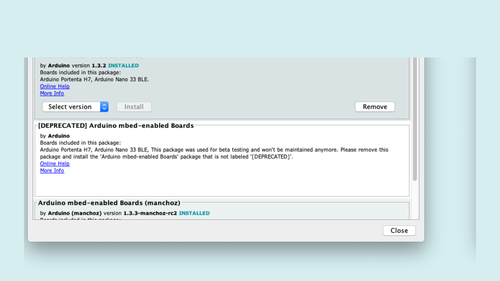

# Getting Started With The Vision Shield Camera 
## Overview
This tutorial shows you how to capture frames from the Vision Shield Camera module and visualise the video output through a Processing sketch. 

### You Will Learn
-   Capturing the frames from the camera.
-   Sending the frames through Serial communication. 
-   Visualising the frames on Processing. 

### Required Hardware and Software
-   Portenta H7 board (<https://store.arduino.cc/portenta-h7>)
-   Portenta Vision Shield ( [LoRa](https://store.arduino.cc/portenta-vision-shield-lora) or [Ethernet](https://store.arduino.cc/portenta-vision-shield) )
-   USB C cable (either USB A to USB C or USB C to USB C)
-   Arduino IDE 1.8.10+  or Arduino Pro IDE 0.0.4+ 
-   Processing 3.5.4

## Instructions

Accessing the vision shield is done through help of both Arduino and Processing tools. The Arduino sketch handles the capture of image data by the onboard camera while the java applet created on Processing helps us visualise this info. With the help of serial communication. you can create a channel that reroutes the frames from the Camera to the java applet. The following steps will run you through how to capture, package the data through the serial port and visualise the output in Processing. 

### 1. The Basic Setup
Connect the Vision Shield to your Portenta H7 as shown and plugin the H7 to your computer. 


Open the board manager on the Arduino IDE and install the latest version of the MBED Core (1.3.2)



### 2. Capturing the Frames

To capture the frames you will need to use the `camera.h` thats included in the Mbed core. This library contains all apis related to frame capture,motion detection and pattern recognition. Include the header file in your sketch. 

```c++
#include "camera.h"
```

Next, lets intialise a camera object and a frame buffer of the size 320*240

```c++
CameraClass cam;
uint8_t fb[320*240];
```

In the `setup()`, lets start the Serial communication at `921600` baud rate and iniitialise the camera using `cam.begin()`. 

```c++
void setup() {
  Serial.begin(921600);
  // Init the cam QVGA, 30FPS
  cam.begin(CAMERA_R320x240, 30);
}
```

In the loop we need to captire each Frame and send it over serial communicatio to the processing sketch that will display the frames. we will use the `grab(uint8_t *buffer, uint32_t timeout=5000);` api to fetch the frame from tthe frame buffer. 

```c++
void loop() {
    // put your main code here, to run repeatedly:
    if (Serial) {
      // Grab frame and write to serial
      if (cam.grab(fb) == 0) {
      Serial.write(fb, 320*240);
      }
      while(Serial.read() != 1){};
  }
} 
```

### 3. Create the Processing Sketch 

Open a new processing sketch file and name it `CameraCapture.pde`. 


Lets start by iniitialising the libraries and variables you will need to process the captured  To process the data sent by the Vision Shield you will need to import the following libraries :  

-  `processing.serial.*` : a [Serial Library](https://processing.org/reference/libraries/serial/index.html)  that is used to read and write data to external devices over the serial line. 
- `java.nio.ByteBuffer`  : a java class that provides access to operations on byte buffers

```java
import processing.serial.*;
import java.nio.ByteBuffer;
```

Next we initialise the following variables to process the recieved pixels from the serial line. We set the dimensions, pixel count, and bytes required per frame. 

```java
// must match resolution used in the sketch
final int cameraWidth = 320;
final int cameraHeight = 240;
final int cameraBytesPerPixel = 1;
final int cameraPixelCount = cameraWidth * cameraHeight;
final int bytesPerFrame = cameraWidth * cameraHeight * cameraBytesPerPixel;
```

To recieve the frames you will need a Serial , PImage objects and an array to store the pixel values of the frame. Add the following variables to the code. 

```java
Serial myPort;
PImage myImage;
byte[] frameBuffer = new byte[bytesPerFrame];
int pixelPosition = 0; 
```

Here we will establish connection to the serial line, prepare the buffer to store the frame pixels and the image  variables 

```java
void setup()
{
  size(320,240);
  
  // if you know the serial port name
  //myPort = new Serial(this, "COM5", 9600);                    // Windows
  //myPort = new Serial(this, "/dev/ttyACM0", 921600);          // Linux
  myPort = new Serial(this, "/dev/cu.usbmodem14101", 9600);     // Mac
 
  // Set the number of bytes to buffer 
  myPort.buffer(bytesPerFrame)
  
  // Create an image based on the camera's dimensions and format
  myImage = createImage(cameraWidth, cameraHeight, ALPHA);  
}  

void draw()
{
  image(myImage, 0,0);
}
```

### 4. Visualing the Frames  

For this step, you will need the help of the `serialEvent()` api to update the `myImage`as an when a new frame arrives on the serial port.

```java
void serialEvent(Serial myPort) {
}
```

The first thing you need to inside this method is to read the  bytes from the `frameBuffer` array which you can do with the help of the  [`readBytes()`](https://processing.org/reference/libraries/serial/Serial_readBytes_.html) method that returns an integer value for the number of bytes read. 

```java
// Read the raw bytes
int bytesRead = myPort.readBytes(frameBuffer);
```

Next we parse the frame buffer to get the different pixel values ; draw the image based on the pixelPosition and [`color()`](https://processing.org/reference/color_.html) and [`Byte.toUnsignedInt()`](https://docs.oracle.com/javase/8/docs/api/java/lang/Byte.html). We then update the size of the array 

```java
// Reading the buffer and plotting the pixels  
for(int i=0; i < bytesRead; ++i){      
    byte pixelValue = frameBuffer[i];      
    myImage.pixels[pixelPosition] = color(Byte.toUnsignedInt(pixelValue));
    ++pixelPosition;
  }  
```

Once all the pixels have been rendered, you need to send an acknowledgement back to the arduino sketch to send the pixels for the next frame. We will update the image through `updatePixels()`, reset the `pixelPosition` to `0`and write `1` to the serial port  

```  c++
// Let the Arduino sketch know we received all pixels
// and are ready for the next frame
if(pixelPosition == cameraPixelCount){
    myImage.updatePixels();
    pixelPosition = 0;
    myPort.write(1);    
  } 
```

heres the complete sketch for the `serialEvent()` function 

```java
void serialEvent(Serial myPort) {
  
  // read the raw bytes 
  int bytesRead = myPort.readBytes(frameBuffer);    
  
  for(int i=0; i < bytesRead; ++i){      
    byte pixelValue = frameBuffer[i];      
    myImage.pixels[pixelPosition] = color(Byte.toUnsignedInt(pixelValue));
    ++pixelPosition;
  }    
  
  // Let the Arduino sketch know we received all pixels
  // and are ready for the next frame
  if(pixelPosition == cameraPixelCount){
    myImage.updatePixels();
    pixelPosition = 0;
    myPort.write(1);    
  }      
  
}
```

### 5. Upload the sketch

Select the right serial port on your IDE and upload the Arduino sketch to your H7 and after a successful upload, run the `CameraViewer.pde`  sketch. You should be able to see the rendered camera output on the processing canvas.


## Conclusion

### Next Steps
-   A
-   B

### Complete Sketch

The `CaptureRawBytes.ino` Sketch. 

```c++
#include "camera.h"

CameraClass cam;
uint8_t fb[320*240];

void setup() {

  Serial.begin(921600);

  // Init the cam QVGA, 30FPS
  cam.begin(CAMERA_R320x240, 30);
}

void loop() {
  // put your main code here, to run repeatedly:
  if (Serial) {
    // Grab frame and write to serial
    if (cam.grab(fb) == 0) {
       Serial.write(fb, 320*240);       
    }
    while(Serial.read() != 1){};
  }
}
```

The `CameraViewer.pde` Sketch. 

```java
/*
  This sketch reads a raw Stream of RGB565 pixels
  from the Serial port and displays the frame on
  the window.
  Use with the Examples -> CameraCaptureRawBytes Arduino sketch.
  This example code is in the public domain.
*/

import processing.serial.*;
import java.nio.ByteBuffer;
import java.nio.ByteOrder;

Serial myPort;

// must match resolution used in the sketch
final int cameraWidth = 320;
final int cameraHeight = 240;
final int cameraBytesPerPixel = 1;
final int cameraPixelCount = cameraWidth * cameraHeight;
final int bytesPerFrame = cameraWidth * cameraHeight * cameraBytesPerPixel;

PImage myImage;
byte[] frameBuffer = new byte[bytesPerFrame];
int pixelPosition = 0; 

void setup()
{
  //initialise the canvas 
  size(320, 240);

  // if you have only ONE serial port active
  //myPort = new Serial(this, Serial.list()[0], 9600);          // if you have only ONE serial port active

  // if you know the serial port name
  //myPort = new Serial(this, "COM5", 9600);                    // Windows
  //myPort = new Serial(this, "/dev/ttyACM0", 921600);            // Linux
  myPort = new Serial(this, "/dev/cu.usbmodem14101", 9600);     // Mac

  // wait for full frame of bytes
  myPort.buffer(bytesPerFrame);  
  myImage = createImage(cameraWidth, cameraHeight, ALPHA);
}

void draw()
{
  image(myImage, 0, 0);
}

void serialEvent(Serial myPort) {
  
 // read the raw bytes 
  int bytesRead = myPort.readBytes(frameBuffer);    
  
  for(int i=0; i < bytesRead; ++i){      
    byte pixelValue = frameBuffer[i];      
    myImage.pixels[pixelPosition] = color(Byte.toUnsignedInt(pixelValue));
    ++pixelPosition;
  }    
  
  // Let the Arduino sketch know we received all pixels
  // and are ready for the next frame
  if(pixelPosition == cameraPixelCount){
    myImage.updatePixels();
    pixelPosition = 0;
    myPort.write(1);    
  }      
}
```


## Troubleshooting

### Sketch Upload Troubleshooting
Lorem ipsum dolor sit amet, consectetuer adipiscing elit. Aenean commodo ligula eget dolor. Aenean massa. Lorem ipsum dolor sit amet, consectetuer adipiscing elit. Aenean commodo ligula eget dolor. Aenean massa. Lorem ipsum dolor sit amet, consectetuer adipiscing elit. Aenean commodo ligula eget dolor. Aenean massa. 

**Authors:** Lenard George, YY
**Reviewed by:** ZZ [18.03.2020]  
**Last revision:** AA [27.3.2020]