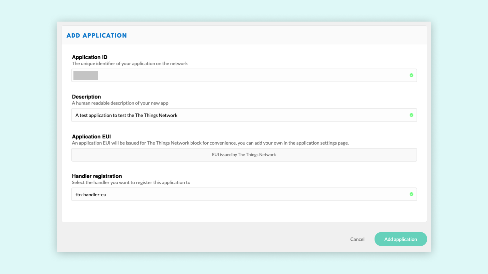
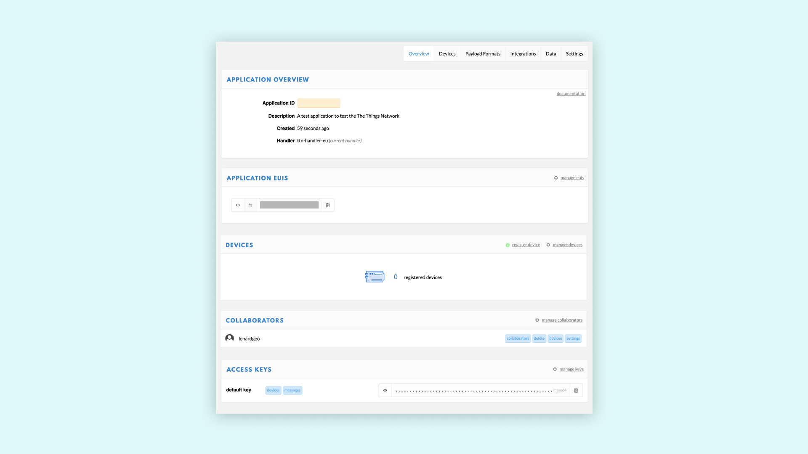

# Connecting the Vision Shield to TTN
This tutorial explains how to connect your Portenta H7 to The Things Network (TTN) using the the Vision Shield's Lora Connectivity feature. A data communication channel will be enabled between the H7 and a TTN application that will be configured on your TTN console.

[note]

**Note :** Ensure that you are within range (10 Km) from an available Lora Gateway before you try this tutorial. Check availability on [The Things Network map](https://www.thethingsnetwork.org/map).

[/note]

## You Will Learn
-   About LoRaWAN® and The Things Network,
-   About creating a TTN application,
-   How to establish a connection between the H7 and the TTN,
-   How to send a payload from the H7 to the TTN.

## Required Hardware and Software
-   [Portenta H7 board](https://store.arduino.cc/portenta-h7)
-   [Vision Shield LoRa](https://store.arduino.cc/portenta-vision-shield-lora)
-   [1x Dipole Pentaband antenna](https://store.arduino.cc/antenna) or a UFL Antenna 
-   Arduino IDE ([online](https://create.arduino.cc/) or [offline](https://www.arduino.cc/en/main/software))
-   USB C cable (either USB A to USB C or USB C to USB C)
-   An [account](https://account.thethingsnetwork.org/users/login) with The Things Network

## 1.  Setting up the Environment 

The Vision Shield LoRa can be connected to the TTN and can transmit data to other devices connected to this network through a secure channel. This channel is nothing but an applicaiton on the TTN network dedicated for your board. In this tutorial, you will be guided through a step-by-step process of setting up your Portenta board and the Vision Shield Lora to communicate with a TTN application. As stated before, to be able to follow this guide, to be under coverage of one of the TTN gateways. You can check for the coverage now if you have not done so yet.


 If you are not in rage you'll need to build up your own gateway (find help to do so here). If everything seems right Just point your browser to www.thethingsnetwork.org and use the Sign Up button to setup an account. Otherwise just sign in. Next, then fill all the required fields to complete a new registration (skip this step if you already have a TTN account):


## 2.  Creating an app on TTN

Once you have created an account with TTN, you need to create a TTN [application](https://www.thethingsnetwork.org/docs/applications/). An application provides a way to aggregate data from different devices, and then use these data with other online / offline tools. Go to your [console](https://console.thethingsnetwork.org), and select on **Applications** 


Here you'll have a list of all your applications. Now create your first app by pressing the **add application** link


You have now to fill only the first two fields:

* The first one is the **ID** of your app: this must be lowercase and without spaces.
* The second one is a **Description** of your app, and there's no restrictions on formatting



After completing these two fields, press on the "Add application" button located at the bottom right corner of the page. The dashboard will then show you an overview of the newly created app. 



Let's take a closer look at these sections:

* **Application Overview** and Application EUIS: in order to use this app, you'll need the Application ID and its EUIs. An EUI is a globally unique identifier for networks, gateways applications and devices. The EUIs are used to identify all parts of the LoRaWAN inside the backend server.
* **Devices**: here you can see and manage all the associated devices (e.g. your Portenta H7 with Vision Shield Lora, Arduino MKR WAN 1300 or MKR WAN 1310), or proceed with the registration of new one.
* **Collaborators**: here you can see and manage all the app collaborators. To integrate with other collaborative platforms or to manage access rights to the app with other TTN registered profiles.
* **Access keys**: it's the most sensible information. It is basically the key to gain access to your app, so keep it safe. At the right, there's a little button that allows you to copy the Access Key.

## 3. Configuring the Vision Shield
It's now time to connect your Portenta H7 and Lora Vision Shield to TTN. You'll need to upload code to the board, so as you porbably already know, there are two options:

* Use the [Arduino Web Editor](https://create.arduino.cc/editor) (this is the option this guide will follow)
* Use the [Arduino IDE](https://www.arduino.cc/en/software), this way requires manual installation or updating the Arduino core and libraries.

Plug the Vision Shield to the Portenta H7 and them to your PC through the usb port. Be sure to have selected the right board "Arduino Portenta H7 (M7 core)" and the right port.


The LoRa module on the Vision Shield can be accessed by using the [MKRWAN library](https://github.com/arduino-libraries/MKRWAN). This library provides all the APIS to communicate with LoRa and LoRaWAN networks and can be Installed from the library Manager. The first code you need to upload and run is from the **MKRWAN** library, and its name is _FirstConfiguration_.


The only line you may need to change before uploading the code is the one that sets the frequency. Update the frequency code according to your country. You can find more information about frequency by country at [this TTN link](https://www.thethingsnetwork.org/docs/lorawan/frequency-plans.html).

```
... // change this to your regional band (eg. US915, AS923, ...)
 if (!modem.begin(EU868)) {    ...
```

[note]

Please, consider that in Australia the boards connect correctly to TTN gateways on AS923 frequencies; AU915 frequencies requires the selection of sub band 2, not yet implemented in the firmware.

[/note]

Once the sketch completes upload, open the Serial Monitor. The following details will show:

```
Your module version is: ARD-078 1.1.9
Your device EUI is: a8xxxxxxxxxxxx0a
Are you connecting via OTAA (1) or ABP (2)?
```

## 4. Registring the Portenta on TTN

Before your Portenta H7 can start communicating with the TTN you need to [register](https://www.thethingsnetwork.org/docs/devices/registration.html) it with an application. go back to  scroll to the **Devices** section on your Application dashboard and click on  **Register Device** link. 


On the registration page that shows up we must fill in two fields. The first one is the **Device ID** which this must be lowercase and without spaces. Since the ID should be unique, so you can use  the name of the board followed by the first and the last byte of the EUI. The second one is the **EUI** which is exactly the device EUI that appeared in the Serial Monitor. Copy paste the EUI from the serial moniter into the EUI field 


After pressing the Register button, your board will show up on the **Device Overview** page. You can now see all the information needed to complete the Arduino setup.


## 5. Connecting to TTN

Once your board has been registered you can send information to TTN. Let's come back to the Serial Monitor and proceed. It will ask for:

* activation mode (that in this case is OTAA),
* the Application EUI
* the App Key.

The EUI and the App key from TTN **Device Overview** page. Lets start by making a connection through the OTAA. Enter "1" in the serial monitor input box and press ENTER.

```
Your module version is: ARD-078 1.1.9
Your device EUI is: a8xxxxxxxxxxxx0a
Are you connecting via OTAA (1) or ABP (2)?
Enter your APP EUI
Enter your APP KEY
```

we enter "1" in the serial monitor input box and press ENTER.

>You can go deep into OTA vs ABP activation mode at [this link](https://www.thethingsnetwork.org/docs/devices/registration.html)

Then we introduce the **APP EUI** and the **APP KEY** in the Serial moniter in a similar manner. If everything has gone fine, you will see this message:

```
Message sent correctly!
```

The Device status on TTN should update displaying last connection time.

# Conclusion

Congratulations! You have configured Portenta H7 and the Lora Vision Shield on the TTN. We have retrieved the device EUI, used it to register the device in the TTN console, and programmed the board using the data provided by TTN.

As long as we are in range of a TTN gateway, we can now send data over the LoRa® network which can be viewed from anywhere in the world (as long as we have an Internet connection). Now you have the tools and knowledge to take the next steps and develop your own IOT applications.

# Next Steps

-   Test the built in integrations
-   Test the API and the available SDKs libraries

Find all the details here: [TTN Applications](https://www.thethingsnetwork.org/docs/applications/)

# Troubleshooting

The most common issue is that the device cannot connect to a TTN gateway. Again, it is a good idea to check if we have coverage in the area we are conducting this tutorial, by checking out [this map](https://www.thethingsnetwork.org/map).

If we are within good range of a gateway, we should also try to move our device and antenna to a window, and even hold it out the window and move it around. This has proven successful on numerous accounts, as the signal can travel less obstructed. 

**Authors:** Karl Söderby, Ignacio Herrera
**Reviewed by:** Lenard George [18.03.2020]  
**Last revision:** AA [27.3.2020]