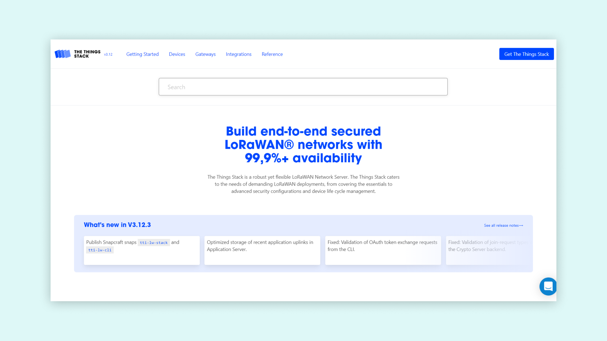
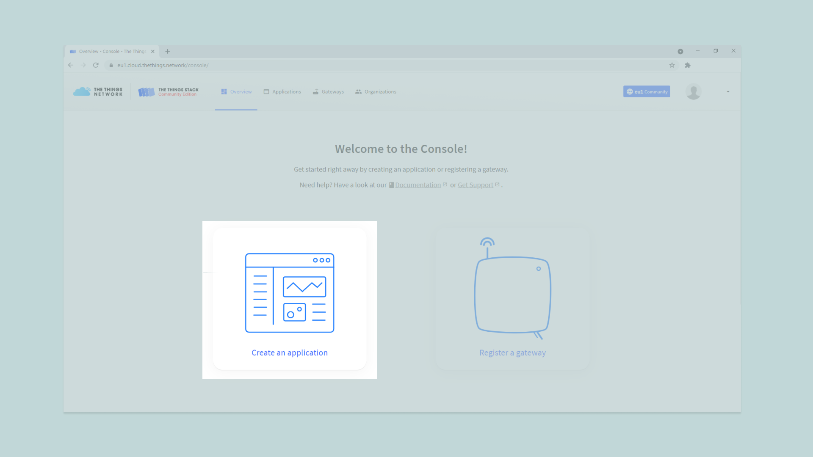
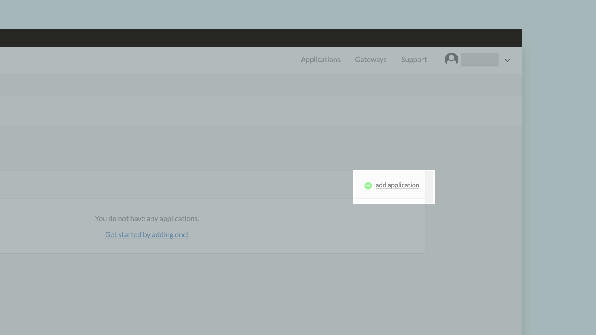
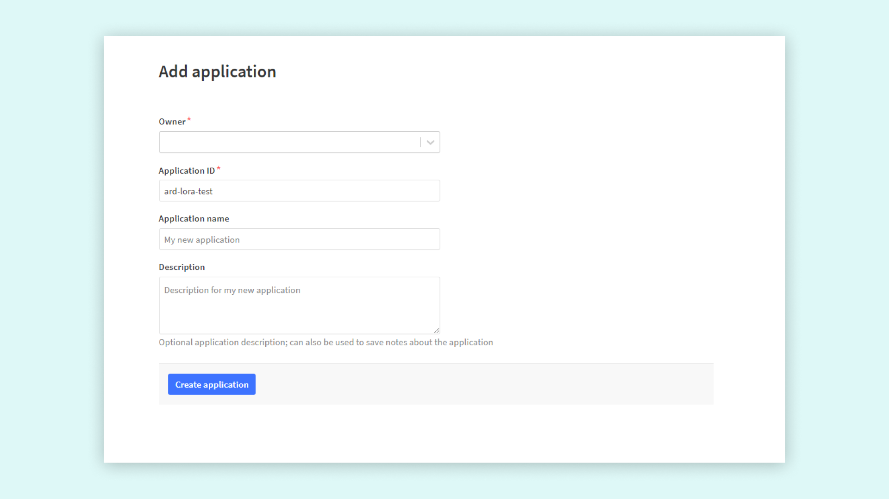
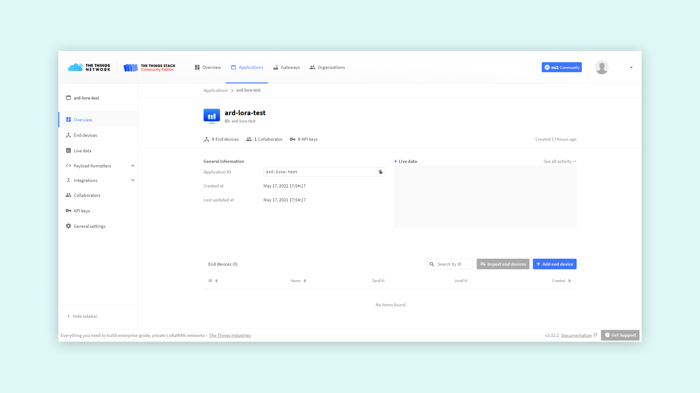
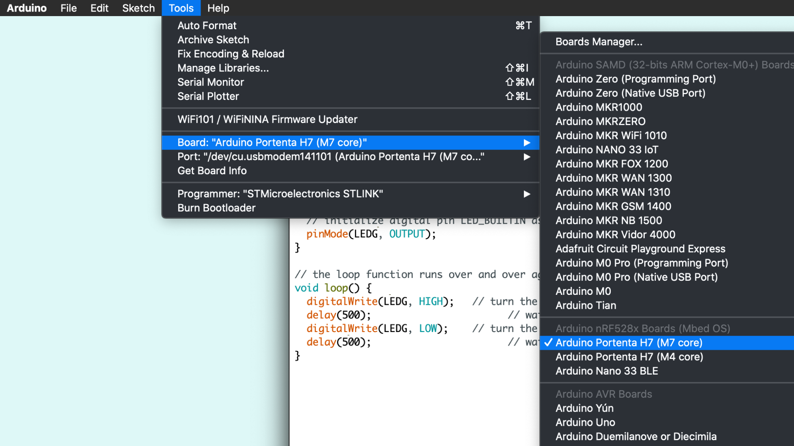
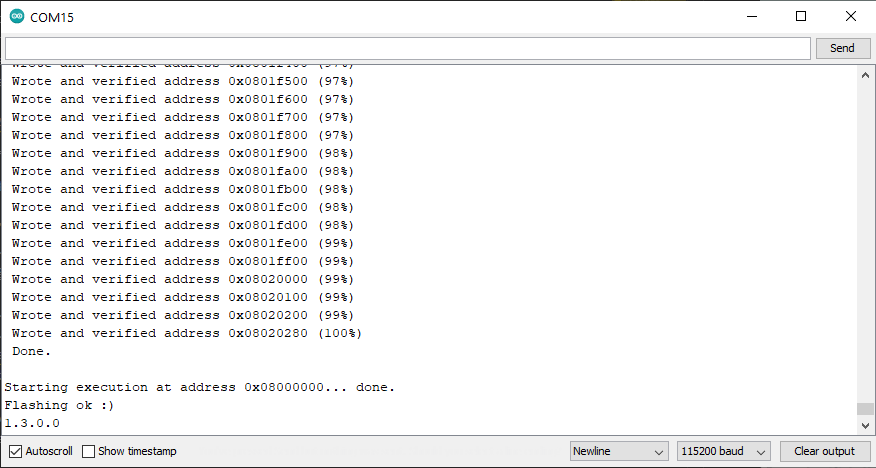
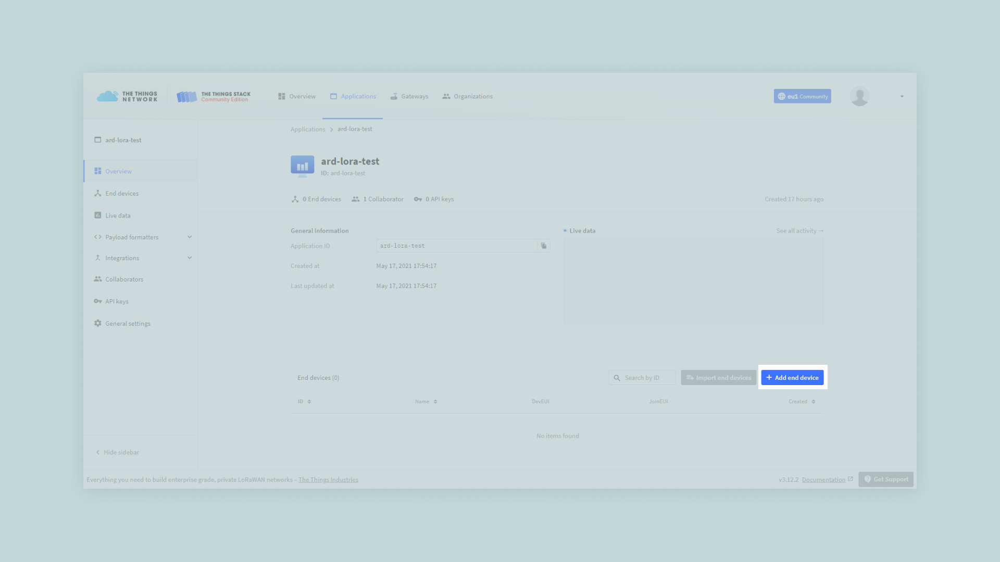
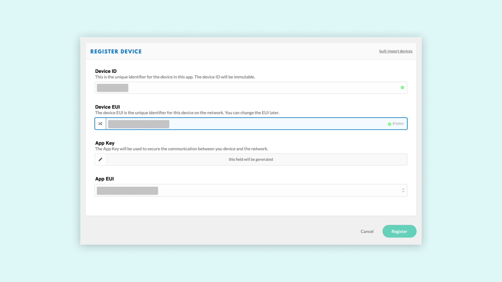
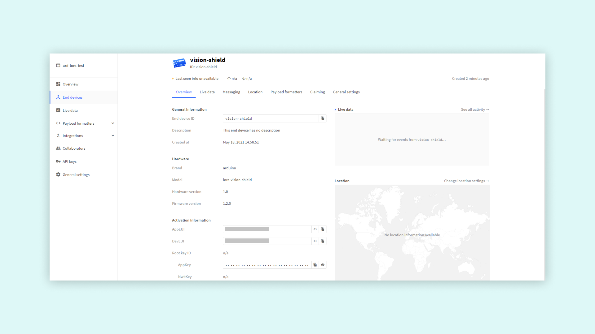

# Connecting the Vision Shield to TTN Using LoRa and OpenMV
## Overview 

This tutorial explains how to connect your Portenta H7 to The Things Network (TTN) using the Vision Shield's LoRa Connectivity feature. A data communication channel will be enabled between the H7 and a TTN application that will be configured on your TTN console.

***In order to connect your Portenta to the TTN make sure you are within the range (max. 10 Km) from an available LoRa Gateway. Indoor gateways will have a much shorter range. It is recommended that you check LoRa Gateway availability on [The Things Network map](https://www.thethingsnetwork.org/map) before you try this tutorial.***

### You Will Learn

- About LoRaWAN® and The Things Network,
- About creating a TTN application,
- How to establish a connection between the H7 and the TTN,

### Required Hardware and Software

- [Portenta H7 board](https://store.arduino.cc/portenta-h7)
- [Portenta Vision Shield - LoRa](https://store.arduino.cc/portenta-vision-shield-lora)
- [1x Dipole Pentaband antenna](https://store.arduino.cc/antenna) or a UFL Antenna of the H7 
- [OpenMV IDE](https://openmv.io/pages/download)
- Arduino IDE 1.8.10+ or Arduino Pro IDE 0.0.4+ or Arduino CLI 0.13.0+
- USB C cable (either USB A to USB C or USB C to USB C)
- An [account on The Things Network](https://account.thethingsnetwork.org/users/login) with The Things Network

## Instructions

The Portenta Vision Shield - LoRa can be connected to the TTN and can transmit data to other devices connected to this network through a secure channel. This channel is nothing but an application on the TTN network dedicated for your board. In this tutorial, you will be guided through a step-by-step process of setting up your Portenta board and the Vision Shield Lora to communicate with a TTN application. As stated before, to be able to follow this guide, to be under coverage of one of the TTN gateways. You can check for [the coverage](https://www.thethingsnetwork.org/map) now if you have not done so yet.

### 1. Setting up the Environment

Start by pointing your browser to www.thethingsnetwork.org and use the Sign Up button to setup an account. Next, then fill all the required fields to complete a new registration (if you already have a TTN account, skip this step and continue by signing in).



### 2. Creating an App on TTN

Once you have created an account with TTN, you need to create a TTN [application](https://www.thethingsnetwork.org/docs/applications/). An application provides a way to aggregate data from different devices, and then use these data with other 3rd party integrations. Go to your [console](https://console.thethingsnetwork.org), and click on **Applications**



Here you'll have a list of all your applications. Now create your first app by pressing the **add application** button.



You have now to fill only the first two fields:

- The first one is the **ID** of your app: this must be lowercase and without spaces.
- The second one is a **Description** of your app, and there's no restrictions on formatting



After completing these two fields, press on the "Add application" button located at the bottom right corner of the page. The dashboard will then show you an overview of the newly created app.



Let's take a closer look at these sections:

- **Application Overview** and Application EUIS: in order to use this app, you'll need the Application ID and its EUIs. An EUI is a globally unique identifier for networks, gateways applications and devices. The EUIs are used to identify all parts of the LoRaWAN inside the backend server.
- **Devices**: here you can see and manage all the associated devices (e.g. your Portenta H7 with Vision Shield Lora, Arduino MKR WAN 1300 or MKR WAN 1310), or proceed with the registration of new one.
- **Collaborators**: here you can see and manage all the app collaborators. To integrate with other collaborative platforms or to manage access rights to the app with other TTN registered profiles.
- **Access keys**: it's the most sensible information. It is basically the key to gain access to your app, so keep it safe.

### 3. Updating the Modems Firmware

To be able to use the LoRa functionality, we need to first update the modems firmware through the Arduino IDE. Connect the Portenta and Vision shield to your computer and open the Arduino IDE. The LoRa module on the Vision Shield can be accessed by using the [MKRWAN library](https://github.com/arduino-libraries/MKRWAN)(if you can't find it in your examples list, you can go to **tools > library manager** and type "MKRWAN library" to install it). This library provides all the APIS to communicate with LoRa and LoRaWAN networks and can be installed from the library manager. Select the **Portenta H7 (M7 core)** board in the Arduino IDE, like shown below.



The code you need to upload and run is from the **MKRWAN** library, and its name is **MKRWANFWUpdate_standalone**. With the Portenta M7 selected, upload the **MKRWANFWUpdate_standalone** sketch. 

//REPLACE


After uploading the sketch, open the serial monitor to confirm that the firmware has been updated. If the upload was successful it will print the progress in the serial monitor.



If it all went correctly, you should see the same text in your serial monitor as on the image above.

### 4. Configuring the Vision Shield

It's now time to connect your Portenta H7 and Lora Vision Shield to TTN. You'll need to upload code to the board using [OpenMV](https://openmv.io/pages/download)

Plug the Portenta Vision Shield - LoRa to the Portenta H7 and them to your PC through the USB port. If the Portenta board does not show up on OpenMV, try double-pressing the reset button on the Portenta. And now update to the latest firmware in OpenMV.

Now we can put the code needed in OpenMV. Below you can see the full sketch, simply copy it into a new sketch in OpenMV.

The `lora.join_OTAA()` or `lora.join_ABP()` functions connects your vision shield to the things network (TTN), using either OTTA or ABP protocols. We just need to enter our `appEui` and `appKey`. The timeout decides how long the board will try and connect before stopping.

We send data to our TTN application with `lora.send_data()`, in here we can decide what data we want to send.

```py
from lora import *

lora = Lora(band=BAND_EU868, poll_ms=60000, debug=False)

print("Firmware:", lora.get_fw_version())
print("Device EUI:", lora.get_device_eui())
print("Data Rate:", lora.get_datarate())
print("Join Status:", lora.get_join_status())

appEui = "" # Add your App EUI here
appKey = "" # Add your App Key here

try:
    lora.join_OTAA(appEui, appKey, timeout=20000)
    # Or ABP:
    #lora.join_ABP(devAddr, nwkSKey, appSKey, timeout=5000)
# You can catch individual errors like timeout, rx etc...
except LoraErrorTimeout as e:
    print("Something went wrong; are you indoor? Move near a window and retry")
    print("ErrorTimeout:", e)
except LoraErrorParam as e:
    print("ErrorParam:", e)

print("Connected.")
lora.set_port(3)

try:
    if lora.send_data("HeLoRA world!", True):
        print("Message confirmed.")
    else:
        print("Message wasn't confirmed")

except LoraErrorTimeout as e:
    print("ErrorTimeout:", e)

# Read downlink messages
while (True):
    if (lora.available()):
        data = lora.receive_data()
        if data:
            print("Port: " + data["port"])
            print("Data: " + data["data"])
    lora.poll()
    sleep_ms(1000)

```

The only line you may need to change before uploading the code is the one that sets the frequency. Set the frequency code according to your country if needed. You can find more information about frequency by country at [this TTN link](https://www.thethingsnetwork.org/docs/lorawan/frequency-plans.html).

```py
// change this to your regional band (eg. US915, AS923, ...)
lora = Lora(band=BAND_EU868, poll_ms=60000, debug=False)
```
***Consider that in Australia the boards connect correctly to TTN gateways on AS923 frequencies; AU915 frequencies requires the selection of sub band 2 which is not yet implemented in the firmware.***

Once you have added to the sketch the frequency according to your country, you can upload it to the board.

Then, once the upload is completed open the Serial Terminal where you can now see firmware info, device EUI, data rate and join status.

In order to select the way in which the board is going to connect with TTN (OTAA or ABP) we need to configure it on the TTN portal. We will see which option we should select in the following steps.

### 5. Registring the Portenta on TTN

Before your Portenta H7 can start communicating with the TTN you need to [register](https://www.thethingsnetwork.org/docs/devices/registration.html) the board with an application. Go back to the TTN portal and scroll to **Devices** section on your Application dashboard, then click **Register Device**.



On the registration page, fill in **Device ID** and **EUI**. 
**Note**: The Device ID must be lowercase and without spaces. The **EUI** should be copied from the Serial Monitor.



After pressing the Register button, your board will show up on the **Device Overview** page. You can now see all the information needed to complete the Arduino setup.



### 6. Connecting to TTN

Once your board has been registered you can send information to TTN. Let's go back to the sketch to fill in the appEui and appKey. The sketch we use here will use OTA connection.

You can read more into OTA vs ABP activation mode at [this link](https://www.thethingsnetwork.org/docs/devices/registration.html)

Once your board has been registered you can send information to TTN. Let's proceed in OpenMV. In the sketch the application EUI and the app key needs to be filled in. Find the EUI and the App key from TTN **Device Overview** page.

If this process is done successfully, you will see this message:

```text
Message confirmed.
```

## Conclusion

If you receive this message, you have managed to configure the Portenta H7 and the Lora Vision Shield on the TTN.
 We have retrieved the device EUI, used it to register the device in the TTN console, and programmed the board using the data provided by TTN. Now, we can send data over the LoRa® network which can be viewed from anywhere in the world (as long as we have an Internet connection and our device is in range from a TTN gateway).

### Next Steps

- Experiment your Vision Shield's capabilities with OpenMV and the examples from the dedicated library for Arduino. You can continue with [this tutorial](https://www.arduino.cc/pro/tutorials/portenta-h7/por-openmv-bt) from the Arduino Pro site.
-  Combine LoRaWAN protocol with an OpenMV example to develop your own IoT application. Take advantage of the Vision Shield's camera to detect, filter, classify images, read QR codes or more.     

## Troubleshooting

The most common issue is that the device cannot connect to a TTN gateway. Again, it is a good idea to check if we have coverage in the area we are conducting this tutorial, by checking out [this map](https://www.thethingsnetwork.org/map).

If we are within good range of a gateway, we should also try to move our device and antenna to a window, and even hold it out the window and move it around. This has proven successful on numerous accounts, as the signal can travel less obstructed.

**Authors:** Lenard George, Ignacio Herrera, Benjamin Dannegård  
**Reviewed by:** Lenard George [2021-03-31]  
**Last revision:** Benjamin Dannegård [2021-03-31]